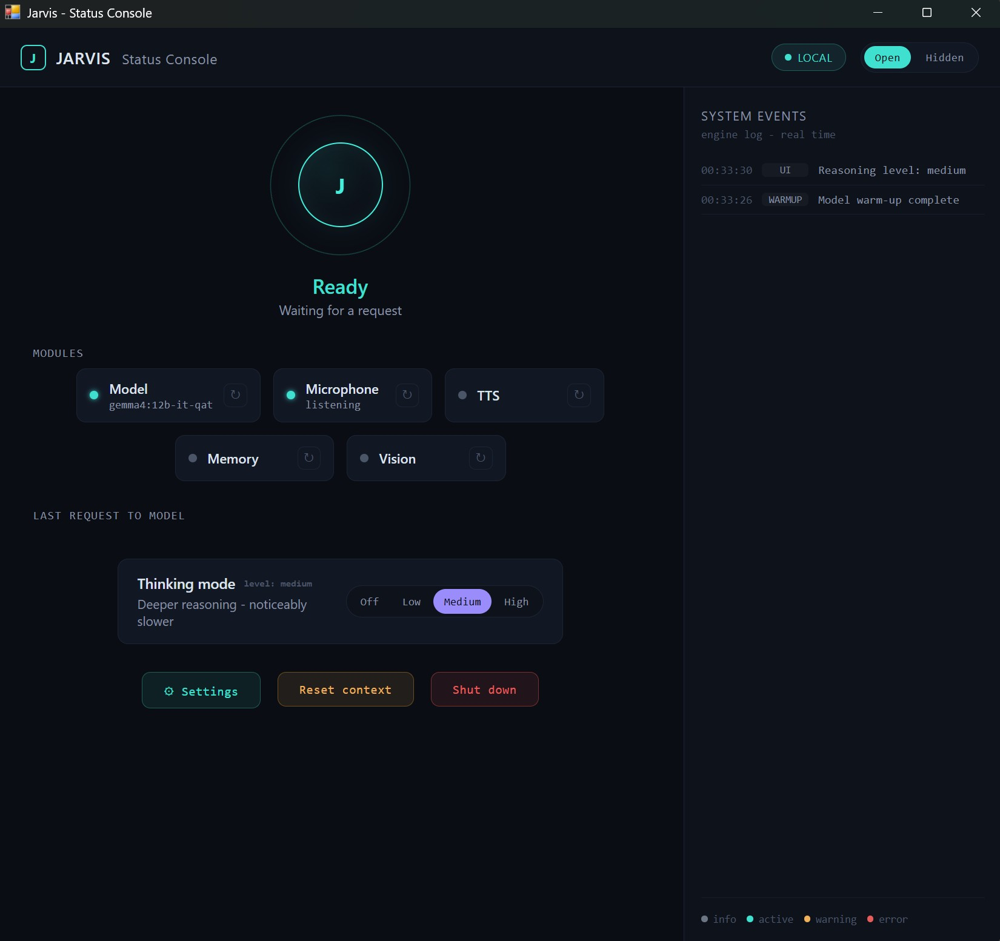
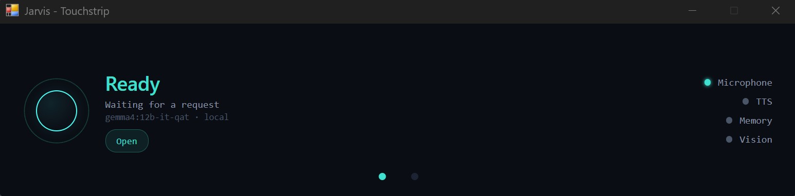
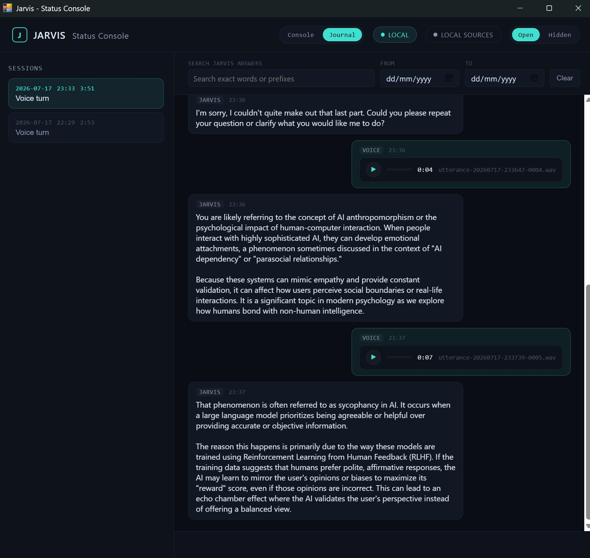

# Jarvis

Jarvis is a local voice and vision assistant for a Windows workstation. It listens through the microphone, sends audio and optional screenshots to a local Ollama model, and speaks answers through configurable local TTS routes.

Jarvis core is designed to run without network access after the one-time setup
steps are complete. The LLM backend is a separate component: the default
supported backend is a local Ollama server on the same machine, but the selected
backend, model installation, updates, or any future non-local provider may have
their own network requirements.

[Russian README](README.ru.md)

## Status Console UI

v1.6.1 includes the Control Center and persistent Dialog Journal evolution of the local desktop Status Console:
runtime and module health, timestamp-first metadata for the latest request to
the model, system events, graded reasoning (Off/Low/Medium/High), Open/Hidden
visibility mode, context reset, guarded Shutdown, typed restart-to-apply
configuration (model, microphone, TTS routes, UI language, and VAD), Journal
text input with local file attachments, answer copy controls, screenshot
thumbnails, manual journal disk management, session fork, editable curated
memory files, local builtin tools for delegated reasoning/memory updates, and a
compact touchstrip glance surface. Since v1.2.11 the UI is English by default,
with Russian available via `[ui].language = "ru"`.







## Status

This is a usable v1.6.1 hobby/research release with verified bilingual TTS:
Silero handles Russian and Piper handles English, with streamed text routed
automatically by character set. TTS engines and local voice models remain
configurable per language. The zero-config compatibility default uses Russian
Silero only; its rough Latin-to-Cyrillic transliteration is a fallback for
users who have not configured the English Piper route, not the recommended
bilingual setup.

The current release also provides four Ollama reasoning levels and injects the
local date, weekday, time, and UTC offset into every accepted model request.
Reasoning traces remain isolated from normal output, TTS, history, UI text, and
logs.

The remaining important limitations are the lack of full echo cancellation
and imperfect OCR on dense screenshots.

Jarvis is not affiliated with Marvel, Disney, or any related trademark owner.

## Features

- Local Ollama backend using `gemma4:12b-it-qat`.
- Voice input with Silero VAD.
- Sentence-level streaming TTS with configurable per-language Silero/Piper
  routes for low perceived latency.
- Full-screen and region screenshot capture.
- Hotkey and sound-cue interface.
- Control Center UI with data-driven module health, timestamp-first latest
  request metadata (without request content), system events, graded reasoning,
  Open/Hidden mode, context reset, guarded Shutdown, typed restart-to-apply
  configuration, and touchstrip glance surface. The UI language is English by
  default; Russian is available via `[ui].language = "ru"` in `config.toml`
  (UI chrome only - the assistant's dialog language and TTS are not affected).
- Persistent Dialog Journal with per-session JSONL logs, typed messages and
  local file attachments to Jarvis, answer copy controls, local audio playback,
  screenshot thumbnails, live feed updates, assistant-answer search, date
  filtering, disk-usage display, manual per-session deletion, session fork
  ("continue this conversation"), explicit blank-context creation, editable
  `memory.md`/`self.md` curated memory files, and Hidden-mode privacy
  enforcement. Journal media and memory files are served through the
  authenticated local transport; search is exact/prefix matching for Russian
  text.
- Journal attachments are current-turn only and stay local. The first
  iteration supports one text file (`.txt`, `.md`, `.csv`, `.json`, `.log`,
  UTF-8, 2 MB upload cap, 20000 model-facing characters), up to four images
  (`.png`, `.jpg`, `.jpeg`, 15 MB each), and one audio file (`.wav`, `.mp3`,
  20 MB, up to 90 s split into 30 s clips). A turn can include at most four
  attached files and 40 MB of file bytes. Hidden mode clears pending
  selections and suppresses upload submission.
- Local builtin tools let Jarvis, through the audited tool path, switch its
  own reasoning level for the next turn and append/replace the user-auditable
  `memory.md` / `self.md` files. These tools stay local and are independent of
  the optional MCP module; successful builtin replace writes save the previous
  version as `memory.md.bak` or `self.md.bak`; privacy controls such as
  microphone sleep, Open/Hidden, and MCP enablement are not delegable.
- Per-turn awareness of the local date, weekday, time, and numeric UTC offset,
  without storing the injected time context in conversation history.
- Async event-bus architecture with isolated modules.
- Type-checked TOML configuration, including the dialog prompts: the
  system prompt and warm-up request are set via `[prompts]` in
  `config.toml` (Russian by default), so the assistant's dialog language
  can be switched without editing source.
- Jarvis core runtime has no network dependency after models are downloaded.

## Requirements

- Windows 11.
- Python 3.11.
- Ollama installed and running.
- A GPU with enough VRAM for the selected Ollama model.

## Installation

Clone this repository, then install Python dependencies:

```bash
pip install -r requirements.txt
```

Pull the Ollama model:

```bash
ollama pull gemma4:12b-it-qat
```

Download and cache the default Silero TTS model once:

```bash
python setup_tts_model.py
```

For another configured Silero package, pass its manifest language and model,
for example `python setup_tts_model.py --language en --model v3_en`.

Optionally create a local config:

```cmd
copy config.example.toml config.toml
```

## Usage

Run from the repository root:

```bash
python -m jarvis
```

Run with the live Status Console UI:

```bash
python -m jarvis --status-console
```

To open only the desktop console, without the touchstrip window:

```bash
python -m jarvis --status-console --no-touchstrip
```

Jarvis uses Windows `RegisterHotKey` for concrete shortcuts. Global shortcuts
were verified from another focused application without Administrator rights;
the former global-key-hook dependency is no longer used.

Default hotkeys:

- `Ctrl+Alt+S`: capture the full screen for the next request.
- `Ctrl+Alt+R`: capture a selected screen region for the next request.
- `Ctrl+Alt+V`: submit clipboard text as a turn.
- `Ctrl+Alt+M`: toggle microphone sleep/wake.
- `Ctrl+Alt+T`: cycle reasoning through Off, Low, Medium, High, and back to Off.
- `Ctrl+Alt+Q`: shut down Jarvis.

## Optional MCP examples: DDGS and Qdrant

MCP stays disabled unless `[mcp].enabled` is explicitly set. The checked-in
example exposes only two canonical tools: `web_search` through DDGS with its
backends fixed to `duckduckgo,wikipedia,brave,mojeek,yahoo,yandex`, and
read-only `search_local_knowledge` through Qdrant. Provider packages use
isolated virtual environments so Qdrant's pinned dependencies cannot change
Jarvis's core environment:

```powershell
python -m venv .venv-mcp-ddgs
& .\.venv-mcp-ddgs\Scripts\python.exe -m pip install "ddgs[mcp]==9.14.4"
python -m venv .venv-mcp-qdrant
& .\.venv-mcp-qdrant\Scripts\python.exe -m pip install "mcp-server-qdrant==0.8.1"
& .\.venv-mcp-qdrant\Scripts\python.exe tools\seed_qdrant_demo.py
Copy-Item examples\mcp\config.ddgs-qdrant-local.toml config.toml
python -m jarvis --status-console
```

The first seed downloads the configured FastEmbed model. `--replace` is
required to recreate an existing collection. For an unauthenticated LAN
Qdrant instance, seed with `--url http://HOST:6333`, edit the placeholder URL
in `config.ddgs-qdrant-lan.toml`, then use that profile. Preserve any existing
non-MCP settings when copying or merging a profile. Also inspect
`config.ui.toml`: its persisted `[mcp].enabled` value takes precedence over
`config.toml`. DDGS 9.14.4 hardcodes `POST` for DuckDuckGo text search, which
returned empty results during live testing. The example profiles therefore
launch `examples/mcp/ddgs_get_mcp.py`; it changes only that provider process to
`GET` before starting the standard DDGS MCP server. After the GET-only path
also failed live, the profiles adopted the explicit multi-backend set from
DDGS issue #390. DDGS aggregates that set rather than guaranteeing a strict
fallback order. The launcher validates the set at startup; it does not edit
the provider environment or enable open-ended `auto` selection. These engines
still use unofficial search-facing contracts, so further provider breakage
remains possible. Print the exact human verification steps with:

```powershell
python -m manual.manual_check_mcp_providers --profile local
python -m manual.manual_check_mcp_providers --profile lan
```

## Architecture

The installable application package lives in `src/jarvis/`. Run it from the
repository root with `python -m jarvis`; production modules are never imported
by modifying `sys.path`. The app is split into small asyncio modules connected
through `bus.py`:

- `audio_in.py`: microphone capture, VAD, utterance chunking.
- `backend.py`: Ollama `/api/chat` streaming adapter.
- `capture.py`: screenshot capture.
- `tts.py`: sentence buffering, configurable Silero/Piper routing, playback.
- `sound_cues.py`: generated local cue sounds.
- `config.py`: TOML settings and validation, including the dialog prompts
  (`[prompts]`) and the UI language (`[ui]`).
- `main.py`: wiring, orchestration, shutdown.

`PROJECT.md` is the source of truth for architectural decisions and verified experiments. The `tasks/` directory keeps story cards, task cards, and bug reports from development.

## Development Process

This repository was built with an agent-assisted workflow: project facts were recorded in `PROJECT.md`, implementation was split into task cards, and day-0 experiments were kept as verified constraints instead of being rediscovered during later work. That history is intentionally public because it shows the engineering trade-offs behind v1.0: local multimodal model behavior, audio payload quirks, hotkey limitations, TTS model constraints, latency measurements, and known risks.

## Known Issues

- Global hotkeys use Windows `RegisterHotKey` through `HotkeyProvider` and
  register only Jarvis's concrete combinations. The former Python `keyboard`
  global-key-hook dependency has been removed. Full-screen capture, region
  capture, clipboard submit, microphone sleep/wake, graded reasoning, conflict
  reporting, and shutdown were verified globally without elevation.
- The Status Console has a guarded Shutdown control (desktop: click,
  confirm; touchstrip: hold ~2s), routed through the same clean shutdown
  path as the `Ctrl+Alt+Q` hotkey - both stop the engine (background
  tasks, TTS/sound cues, bus subscriptions, hotkeys) and then close the
  live WebView window(s). `Ctrl+C` from the terminal is still not a
  reliable stop path while `pywebview` owns the foreground UI loop.
- A true cold Ollama start can take long enough to require a generous read timeout.
- Journal logs, audio, and screenshots have no automatic retention policy yet;
  use the Journal view's manual per-session deletion controls until a
  disk-growth policy is decided.
- Closing the Status Console can expose a microphone shutdown race around a
  blocking executor read; see
  [the open bug report](tasks/bug_reports/2026-07-17-shutdown-microphone-executor-race.md).
- There is no real echo cancellation in v1.0. Jarvis can hear its own TTS through speakers; the app includes a cooldown mitigation, not a full fix.
- Silero TTS `v3_1_ru` does not support Latin characters. Jarvis transliterates Latin words to Cyrillic before synthesis as a best-effort workaround.
- Dense screenshots, especially large IDE views, can cause OCR confabulation. Use region capture for targeted questions.
- Region selection currently creates a Tkinter overlay from the hotkey
  callback thread. A defensive guard covers the observed callback-order
  failure, but the threading design remains a documented backlog item.
- Screenshot capture from DirectX applications is not yet a supported
  guarantee. Windowed and borderless-windowed behavior needs a dedicated
  capture-backend spike; failure there does not indicate a hotkey problem.

## Tests

Automated tests cover pure logic only: event bus behavior, sentence buffering, request payload construction, VAD chunking on prerecorded wav fixtures, config parsing, and similar. Run them locally with:

```bash
python -m pytest
```

GitHub Actions (`.github/workflows/ci.yml`) runs `python -m ruff format --check .`,
`python -m ruff check .`, and `python -m pytest` on every push and pull request.
CI does not start Ollama, download models, touch secrets, or exercise hardware.

Hardware-dependent and live checks stay human-run manual handoffs, never CI jobs: microphone, speakers, global hotkeys, screen capture, GPU/VRAM, WebView visual review, and the live Ollama endpoint. Run manual checks as modules from the repository root, for example `python -m manual.manual_check_status_console`; day-0 checks use `python -m manual.day0_checks`. Pure tests for manual-check helpers live under `manual/tests/`.

A green CI run only proves the pure suite passes on a clean dependency install. It does not prove the running app stays free of network calls at run time - that is an architecture/code-review guarantee (see `PROJECT.md`), not something the pytest suite measures.

## Licensing

The project code is released under the MIT License. See [LICENSE](LICENSE).

External model weights are not distributed by this repository and are governed by their own licenses and terms:

- Silero VAD is published under MIT by its upstream project.
- Silero TTS models are governed by Silero Models licensing; the currently configured `v3_1_ru` model is not part of this repository's MIT license.
- Gemma model weights are governed by Google's Gemma terms or the specific license attached to the model you use through Ollama.

Review the upstream model licenses before commercial use or redistribution.
