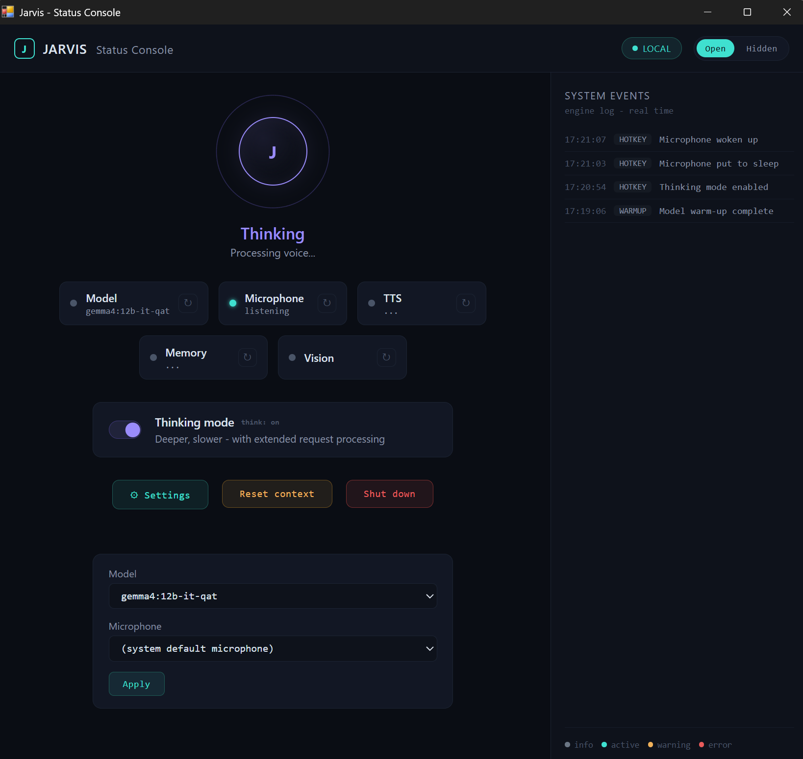
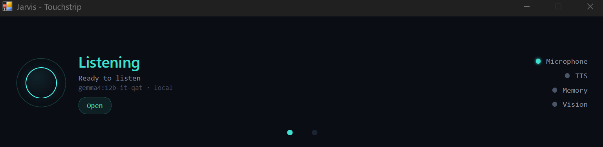

# Jarvis

Jarvis is a local voice and vision assistant for a Windows workstation. It listens through the microphone, sends audio and optional screenshots to a local Ollama model, and speaks answers through configurable local TTS routes.

Jarvis core is designed to run without network access after the one-time setup
steps are complete. The LLM backend is a separate component: the default
supported backend is a local Ollama server on the same machine, but the selected
backend, model installation, updates, or any future non-local provider may have
their own network requirements.

[Russian README](README.ru.md)

## Status Console UI

v1.2 adds a local desktop Status Console for runtime state, system events,
Think mode, Open/Hidden visibility mode, context reset, a guarded Shutdown
control, a restart-to-apply configuration menu (model and microphone
selection), and a compact touchstrip glance surface. Since v1.2.11 the UI
is English by default, with Russian available via `[ui].language = "ru"`.





## Status

This is a usable v1.2 hobby/research release with verified bilingual TTS:
Silero handles Russian and Piper handles English, with streamed text routed
automatically by character set. TTS engines and local voice models remain
configurable per language. The zero-config compatibility default uses Russian
Silero only; its rough Latin-to-Cyrillic transliteration is a fallback for
users who have not configured the English Piper route, not the recommended
bilingual setup.

The remaining important limitations are the lack of full echo cancellation
and imperfect OCR on dense screenshots.

Jarvis is not affiliated with Marvel, Disney, or any related trademark owner.

## Features

- Local Ollama backend using `gemma4:12b-it-qat`.
- Voice input with Silero VAD.
- Sentence-level streaming TTS with configurable per-language Silero/Piper
  routes for low perceived latency.
- Full-screen and region screenshot capture.
- Hotkey and sound-cue interface.
- Local Status Console UI with system events, Think mode, Open/Hidden mode,
  context reset, guarded Shutdown, a restart-to-apply model/microphone
  configuration menu, and touchstrip glance surface. The UI language is
  English by default; Russian is available via `[ui].language = "ru"` in
  `config.toml` (UI chrome only - the assistant's dialog language and TTS
  are not affected).
- Async event-bus architecture with isolated modules.
- Type-checked TOML configuration, including the dialog prompts: the
  system prompt and warm-up request are set via `[prompts]` in
  `config.toml` (Russian by default), so the assistant's dialog language
  can be switched without editing source.
- Jarvis core runtime has no network dependency after models are downloaded.

## Requirements

- Windows 11.
- Python 3.11.
- Ollama installed and running.
- A GPU with enough VRAM for the selected Ollama model.

## Installation

Clone this repository, then install Python dependencies:

```bash
pip install -r requirements.txt
```

Pull the Ollama model:

```bash
ollama pull gemma4:12b-it-qat
```

Download and cache the default Silero TTS model once:

```bash
python setup_tts_model.py
```

Optionally create a local config:

```cmd
copy config.example.toml config.toml
```

## Usage

Run from the repository root:

```bash
python main.py
```

Run with the live Status Console UI:

```bash
python main.py --status-console
```

To open only the desktop console, without the touchstrip window:

```bash
python main.py --status-console --no-touchstrip
```

Jarvis uses Windows `RegisterHotKey` for concrete shortcuts. Global shortcuts
were verified from another focused application without Administrator rights;
the former global-key-hook dependency is no longer used.

Default hotkeys:

- `Ctrl+Alt+S`: capture the full screen for the next request.
- `Ctrl+Alt+R`: capture a selected screen region for the next request.
- `Ctrl+Alt+V`: submit clipboard text as a turn.
- `Ctrl+Alt+M`: toggle microphone sleep/wake.
- `Ctrl+Alt+T`: toggle Think mode.
- `Ctrl+Alt+Q`: shut down Jarvis.

## Architecture

The app is split into small asyncio modules connected through `bus.py`:

- `audio_in.py`: microphone capture, VAD, utterance chunking.
- `backend.py`: Ollama `/api/chat` streaming adapter.
- `capture.py`: screenshot capture.
- `tts.py`: sentence buffering, configurable Silero/Piper routing, playback.
- `sound_cues.py`: generated local cue sounds.
- `config.py`: TOML settings and validation, including the dialog prompts
  (`[prompts]`) and the UI language (`[ui]`).
- `main.py`: wiring, orchestration, shutdown.

`PROJECT.md` is the source of truth for architectural decisions and verified experiments. The `tasks/` directory keeps story cards, task cards, and bug reports from development.

## Development Process

This repository was built with an agent-assisted workflow: project facts were recorded in `PROJECT.md`, implementation was split into task cards, and day-0 experiments were kept as verified constraints instead of being rediscovered during later work. That history is intentionally public because it shows the engineering trade-offs behind v1.0: local multimodal model behavior, audio payload quirks, hotkey limitations, TTS model constraints, latency measurements, and known risks.

## Known Issues

- Global hotkeys use Windows `RegisterHotKey` through `HotkeyProvider` and
  register only Jarvis's concrete combinations. The former Python `keyboard`
  global-key-hook dependency has been removed. Full-screen capture, region
  capture, clipboard submit, microphone sleep/wake, Think mode, conflict
  reporting, and shutdown were verified globally without elevation.
- The Status Console has a guarded Shutdown control (desktop: click,
  confirm; touchstrip: hold ~2s), routed through the same clean shutdown
  path as the `Ctrl+Alt+Q` hotkey - both stop the engine (background
  tasks, TTS/sound cues, bus subscriptions, hotkeys) and then close the
  live WebView window(s). `Ctrl+C` from the terminal is still not a
  reliable stop path while `pywebview` owns the foreground UI loop.
- A true cold Ollama start can take long enough to require a generous read timeout.
- There is no real echo cancellation in v1.0. Jarvis can hear its own TTS through speakers; the app includes a cooldown mitigation, not a full fix.
- Silero TTS `v3_1_ru` does not support Latin characters. Jarvis transliterates Latin words to Cyrillic before synthesis as a best-effort workaround.
- Dense screenshots, especially large IDE views, can cause OCR confabulation. Use region capture for targeted questions.
- Region selection currently creates a Tkinter overlay from the hotkey
  callback thread. A defensive guard covers the observed callback-order
  failure, but the threading design remains a documented backlog item.
- Screenshot capture from DirectX applications is not yet a supported
  guarantee. Windowed and borderless-windowed behavior needs a dedicated
  capture-backend spike; failure there does not indicate a hotkey problem.

## Tests

Automated tests cover pure logic only: event bus behavior, sentence buffering, request payload construction, VAD chunking on prerecorded wav fixtures, config parsing, and similar. Run them locally with:

```bash
python -m pytest
```

The same command runs in GitHub Actions (`.github/workflows/ci.yml`) on push and pull request: install `requirements.txt`, then `python -m pytest`. CI does not start Ollama, download models, touch secrets, or exercise hardware.

Hardware-dependent and live checks stay human-run manual handoffs, never CI jobs: microphone, speakers, global hotkeys, screen capture, GPU/VRAM, WebView visual review, and the live Ollama endpoint. Use the `manual/manual_check_*.py` scripts and `manual/day0_checks.py` for those. Pure tests for manual-check helpers live under `manual/tests/`.

A green CI run only proves the pure suite passes on a clean dependency install. It does not prove the running app stays free of network calls at run time - that is an architecture/code-review guarantee (see `PROJECT.md`), not something the pytest suite measures.

## Licensing

The project code is released under the MIT License. See [LICENSE](LICENSE).

External model weights are not distributed by this repository and are governed by their own licenses and terms:

- Silero VAD is published under MIT by its upstream project.
- Silero TTS models are governed by Silero Models licensing; the currently configured `v3_1_ru` model is not part of this repository's MIT license.
- Gemma model weights are governed by Google's Gemma terms or the specific license attached to the model you use through Ollama.

Review the upstream model licenses before commercial use or redistribution.
