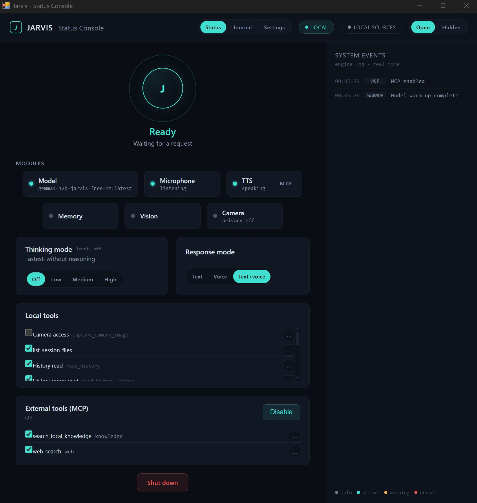
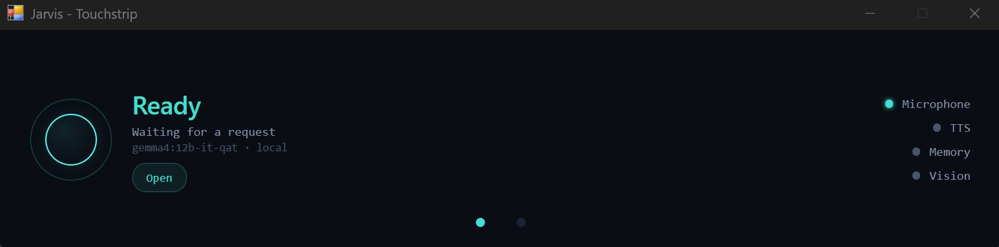
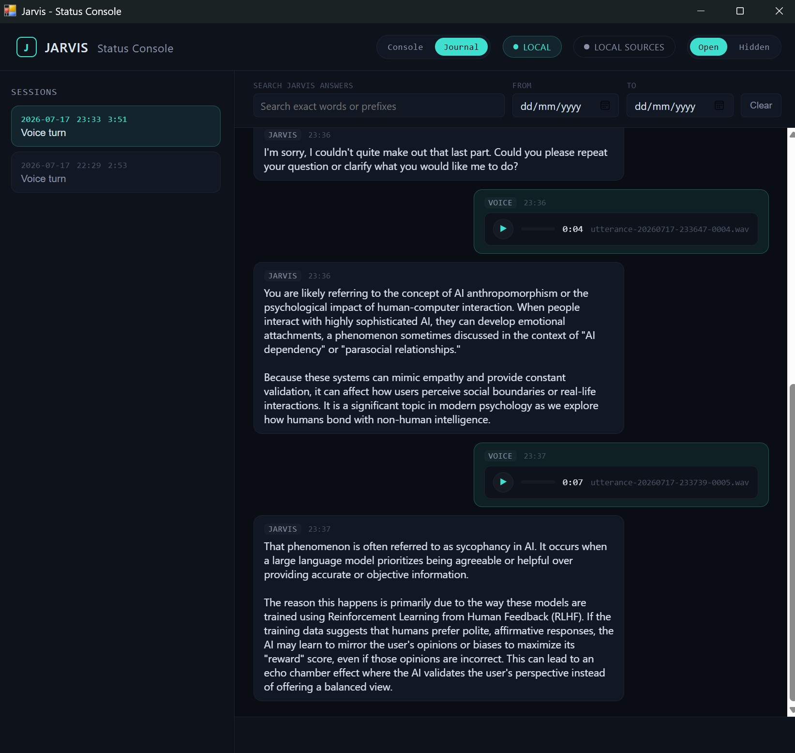

# Jarvis

Jarvis is a local voice and vision assistant for a Windows workstation. It listens through the microphone, sends audio and optional screenshots to a local Ollama model, and speaks answers through configurable local TTS routes.

Jarvis core is designed to run without network access after the one-time setup
steps are complete. The LLM backend is a separate component: the default
supported backend is a local Ollama server on the same machine, but the selected
backend, model installation, updates, or any future non-local provider may have
their own network requirements.

[Russian README](README.ru.md)

## Status Console UI

Since v1.6.3 the console is organized into three tabs, by the nature of the
data rather than by widget type:

- **Status** - live engine state and controls that act immediately: runtime
  and module health, timestamp-first metadata for the latest request to the
  model, graded reasoning (Off/Low/Medium/High), the external tools (MCP)
  toggle with its tool list, system events, and a guarded Shutdown. The
  events panel also records each turn's request to the model in the
  interface language - see [Logs and diagnostics](#logs-and-diagnostics).
- **Journal** - the conversation surface: persistent dialog log, text input
  with local file attachments, answer copy controls, screenshot thumbnails,
  manual journal disk management, session fork, editable curated memory
  files, and the explicit "New context" action.
- **Settings** - cold configuration, restart-to-apply: model, microphone,
  UI language, TTS routes, and VAD.

The header stays the same on every tab: the `LOCAL` and `LOCAL SOURCES`
honesty indicators and the Open/Hidden visibility mode never disappear behind
a tab switch. Local builtin tools for delegated reasoning and memory updates
and the compact touchstrip glance surface are unchanged. Since v1.2.11 the UI
is English by default, with Russian available via `[ui].language = "ru"`.







## Status

This is a usable v1.6.1 hobby/research release with verified bilingual TTS:
Silero handles Russian and Piper handles English, with streamed text routed
automatically by character set. TTS engines and local voice models remain
configurable per language. The zero-config compatibility default uses Russian
Silero only; its rough Latin-to-Cyrillic transliteration is a fallback for
users who have not configured the English Piper route, not the recommended
bilingual setup.

The current release also provides four Ollama reasoning levels and injects the
local date, weekday, time, and UTC offset into every accepted model request.
Reasoning traces remain isolated from normal output, TTS, history, UI text, and
logs.

The remaining important limitations are the lack of full echo cancellation
and imperfect OCR on dense screenshots.

Jarvis is not affiliated with Marvel, Disney, or any related trademark owner.

## Features

- Local Ollama backend using `gemma4:12b-it-qat`.
- Voice input with Silero VAD.
- Sentence-level streaming TTS with configurable per-language Silero/Piper
  routes for low perceived latency.
- Full-screen and region screenshot capture.
- Hotkey and sound-cue interface.
- Control Center UI with data-driven module health, timestamp-first latest
  request metadata (without request content), system events, graded reasoning,
  Open/Hidden mode, context reset, guarded Shutdown, typed restart-to-apply
  configuration, and touchstrip glance surface. The UI language is English by
  default; Russian is available via `[ui].language = "ru"` in `config.toml`
  (UI chrome only - the assistant's dialog language and TTS are not affected).
- Persistent Dialog Journal with per-session JSONL logs, typed messages and
  local file attachments to Jarvis, answer copy controls, local audio playback,
  screenshot thumbnails, live feed updates, assistant-answer search, date
  filtering, disk-usage display, manual per-session deletion, session fork
  ("continue this conversation"), explicit blank-context creation, editable
  `memory.md`/`self.md` curated memory files, and Hidden-mode privacy
  enforcement. Journal media and memory files are served through the
  authenticated local transport; the Journal search box uses the same hybrid
  retrieval surface described in
  [Unlimited conversation history](#unlimited-conversation-history) below.
- Replay past turns from the Journal: a Play control on every playable turn
  plays it and every later playable turn in that session back to back. An
  assistant reply is re-synthesized through TTS on demand (no audio is stored -
  playback is a fresh synthesis under the TTS voice/speed settings active at
  replay time, so a reply spoken earlier can be heard again under the current
  voice); a voice request plays its own original recording, so you hear your
  own voice, not a re-synthesis. Typed requests and system events are skipped.
  Playing a turn near the end plays just that turn; starting higher up plays
  the rest of the conversation in order, with the now-playing turn highlighted
  as playback moves through it. Pause/Resume suspends and continues the current
  turn without losing your place. Replay uses the one playback channel: a Play
  press while Jarvis is already speaking (a live turn or another replay) is
  rejected with the error cue and a message rather than queued, and can simply
  be pressed again once free. The control toggles to Stop while playing; a new
  live turn, `Ctrl+Alt+I`, and disabling TTS each stop an in-progress replay.
- The Text + voice response mode is not merely "the same answer, also spoken";
  it is the key "text canvas + spoken guide" mode. Jarvis first streams the
  canonical rich answer to the screen, then runs a separate second pass with
  reasoning off to speak a derivative commentary over the already-visible
  text. This is deliberately alternative to minimum latency: audio waits for
  the first pass to finish and for one more local model request, in exchange
  for both inspectable text and a spoken guide to it. Retrieval/memory indexes
  only the canonical text; the spoken derivative is stored under the same
  Journal turn as "spoken aloud", but is not treated as an independent source
  of facts.
- Unlimited conversation history: the normal request to Ollama stays a bounded
  working context regardless of how large the local journal grows. See
  [Unlimited conversation history](#unlimited-conversation-history).
- Journal attachments are current-turn only and stay local. The first
  iteration supports one text file (`.txt`, `.md`, `.csv`, `.json`, `.log`,
  UTF-8, 2 MB upload cap, 20000 model-facing characters), up to four images
  (`.png`, `.jpg`, `.jpeg`, 15 MB each), and one audio file (`.wav`, `.mp3`,
  20 MB, up to 90 s split into 30 s clips). A turn can include at most four
  attached files and 40 MB of file bytes. Hidden mode clears pending
  selections and suppresses upload submission.
- Local builtin tools let Jarvis, through the audited tool path, switch its
  own reasoning level for the next turn and append/replace the user-auditable
  `memory.md` / `self.md` files. These tools stay local and are independent of
  the optional MCP module; successful builtin replace writes save the previous
  version as `memory.md.bak` or `self.md.bak`; privacy controls such as
  microphone sleep, Open/Hidden, and MCP enablement are not delegable.
- Session files let Jarvis save and re-read files scoped to the current chat
  session. Through the audited tool path it can write a text file, read text
  back, look at a PNG/JPEG image, and stat/list files. Writes are create-only:
  the model never overwrites, deletes, or renames, and the requested name is
  turned into a generated storage handle (`name-<id>.ext`) that later reads use
  - there is no per-file delete, rename, or arbitrary cross-session access. A
  continued session can read (not write) files inherited from the session it
  continued. You can also tick "Keep in session" on an uploaded attachment to
  persist it as a session file and hand its handle to the model. Session files
  are plain files beside the journal, kept out of the transcript and history
  index, and are removed when you delete their session. See
  [Session files](#session-files).
- On-command camera capture from named USB and LAN (RTSP) sources, off by
  default and gated by a non-delegable switch. Frames are current-turn only,
  each frame stays bound to the source that produced it, and LAN captures are
  reported as `lan` on the data-source axis. See [Camera](#camera).
- Per-turn awareness of the local date, weekday, time, and numeric UTC offset,
  without storing the injected time context in conversation history.
- Durable local system log with bounded rotation for after-the-fact
  diagnosis, alongside a localized per-turn record of what was sent to the
  model in the console's events panel. Neither carries request content.
- Async event-bus architecture with isolated modules.
- Type-checked TOML configuration, including the dialog prompts: the
  system prompt and warm-up request are set via `[prompts]` in
  `config.toml` (Russian by default), so the assistant's dialog language
  can be switched without editing source.
- Jarvis core runtime has no network dependency after models are downloaded.

## Requirements

- Windows 11.
- Python 3.11.
- Ollama installed and running.
- A GPU with enough VRAM for the selected Ollama model.

## Installation

Clone this repository, then install Python dependencies:

```bash
pip install -r requirements.txt
```

Pull the Ollama model:

```bash
ollama pull gemma4:12b-it-qat
```

Download and cache the default Silero TTS model once:

```bash
python setup_tts_model.py
```

For another configured Silero package, pass its manifest language and model,
for example `python setup_tts_model.py --language en --model v3_en`.

Optionally create a local config:

```cmd
copy config.example.toml config.toml
```

## Dialog and reasoning prompts

`[prompts].system` is the base dialog prompt and `[prompts].warmup` is the
one-off startup request. Optional `reasoning_low`, `reasoning_medium`, and
`reasoning_high` sections add guidance only when the selected reasoning level
is Low, Medium, or High. Off has no separate section.

Each reasoning section can be inline text or an `@file-path` reference:

```toml
[prompts]
reasoning_low = "Think briefly, then answer directly."
reasoning_medium = "@/reasoning/medium.md"
reasoning_high = "@reasoning/high.md"
```

`@` is prompt-only syntax: references are always rooted under `./.jarvis/`,
not the filesystem root. For example, `@/reasoning/medium.md` reads
`./.jarvis/reasoning/medium.md`. `..` is rejected, and a missing, unreadable,
non-UTF-8, directory, or blank referenced file stops startup with a config
error. A literal beginning with `@` is not supported because `@` always means
a file reference.

For each accepted turn, Jarvis composes the base system prompt, then the
session's `self.md` and `memory.md` material, then the section for that turn's
sampled reasoning level. Switching levels during an in-flight turn affects
only the next turn.

## Usage

Run from the repository root:

```bash
python -m jarvis
```

Run with the live Status Console UI:

```bash
python -m jarvis --status-console
```

To open only the desktop console, without the touchstrip window:

```bash
python -m jarvis --status-console --no-touchstrip
```

Jarvis uses Windows `RegisterHotKey` for concrete shortcuts. Global shortcuts
were verified from another focused application without Administrator rights;
the former global-key-hook dependency is no longer used.

Default hotkeys:

- `Ctrl+Alt+S`: capture the full screen for the next request.
- `Ctrl+Alt+R`: capture a selected screen region for the next request.
- `Ctrl+Alt+V`: submit clipboard text as a turn.
- `Ctrl+Alt+M`: toggle microphone sleep/wake.
- `Ctrl+Alt+T`: cycle reasoning through Off, Low, Medium, High, and back to Off.
- `Ctrl+Alt+I`: interrupt the active response, stopping speech playback and
  backend generation, then return Jarvis to listening. Also stops an
  in-progress reply replay.
- `Ctrl+Alt+Q`: shut down Jarvis.

## Logs and diagnostics

Jarvis keeps two separate records, for two different questions.

**The system log** answers "what went wrong". It is a detailed English log
file at `logs/jarvis.log`, written whether or not Jarvis was started from a
terminal, and it survives the process exiting. **This is the file to attach
to a problem report.** It rotates at 2 MB and keeps 5 previous files, so the
whole set stays around 10 MB and cannot fill a disk during a long session.
The directory and both bounds are configurable under `[logging]` in
`config.toml`; the setting is the directory, because rotation owns the file
names. If the log cannot be opened, Jarvis still starts and warns instead.

The log never leaves your machine on its own. There is no telemetry, no
upload path, and no network sink - sending it anywhere is always you
attaching a file.

**The events panel** on the Status tab answers "what has Jarvis been doing",
in your interface language. It shows engine events and one record per turn
of what that turn sent to the model - voice with its duration, screenshot,
clipboard, typed message, or attachments. It is a live view holding the most
recent 200 entries and it starts empty on reconnect, so it is not a
diagnostic tool: a crash before the window opens leaves nothing here, which
is exactly why the file log exists.

Neither record contains what you actually said or sent. Both are limited to
kinds, counts, durations, and sizes - no transcripts, no clipboard text, no
image data, and no attachment contents. The events panel additionally holds
no file names, so leaving it visible does not expose anything Hidden mode is
meant to conceal.

## Camera

Jarvis can capture one still frame on request, from a local USB camera or
from a LAN camera over RTSP, and answer questions about what it sees. The
frame enters only the current model turn and is never written to
conversation history.

Two switches gate it, and both are yours alone: `[camera].enabled` in
`config.toml` and the `capture_camera_image` entry in the Status Console's
tool list. The model cannot flip either one. While the camera is off, no
frame is captured at all - the tool fails instead. Every capture plays an
audible cue.

Cameras are configured as a list of named sources under `[[camera.sources]]`
(see `config.example.toml`). Leaving the list out entirely keeps a USB-only
setup working with no edits. Name each source for what it shows rather than
for its wiring, and describe it truthfully: the description is what the model
is told, and it is how the model picks a camera when you say "look at the
wide camera". Several cameras in one turn are captured through several tool
calls, so each frame stays bound to the source that produced it.

USB captures are reported as `local` on the data-source axis; LAN captures
are reported as `lan`, exactly like a LAN MCP tool. A turn using both reports
the wider of the two. No camera path contacts a cloud API: RTSP goes straight
to the camera on your own network.

### Setting up a LAN camera

- **In the camera's own app first.** Create an RTSP/media account and turn
  media-stream encryption off. Without this every request stays `401` no
  matter what you configure here.
- **Credentials go in `config.toml` in clear text.** Anyone who can read that
  file can watch the camera and reuse the password wherever else you used it.
  Give the camera an account used only by Jarvis, and keep the file out of
  version control and backups. Improving this is an open question rather than
  a settled design - see
  [the backlog note](tasks/backlog/secret-storage.md).
- **Never percent-encode anything by hand.** Host, port, user, password, and
  stream path are separate config values and Jarvis assembles the URL, so a
  password containing `#`, `/`, `@`, `:`, `?`, or `&` is typed literally. A
  ready-made URL from the camera's manual cannot be pasted as one line; that
  is the deliberate cost of removing a whole class of silent failures.
- **Finding the stream path is trial and error.** Cameras commonly answer
  `401` to every path until the credentials are correct, so a wrong path and
  a wrong password are indistinguishable. Use
  `python -m manual.manual_check_rtsp_discovery --host <ip> --user <user>` to
  test candidates in milliseconds rather than waiting out a capture timeout
  each time.

### What the camera is good for, and what it is not

Scene description is the supported answer: "what is in this room", "is the
door open", "what is on the desk". Reading text and counting objects are
**not** guarantees, and the failure mode is the dangerous one - on the same
physical shirt the model confidently read "SONY" from one lens and the
correct "BOSS" from another, with no hint of doubt in either answer. Treat
any label, number, or count from a camera frame as a guess, not as fact.

Jarvis reads frames only. It does not aim a motorized lens or switch an
illuminator on, even when the camera supports both: those change the physical
world rather than observing it, and they are gated behind their own future
opt-in rather than the camera switch. See
[the backlog note](tasks/backlog/camera-world-changing-controls.md) for the
reasoning. A consequence worth stating: a motorized lens shows wherever it
was last aimed, including by the camera's own auto-tracking, so its captures
are not reproducible and its description should say so.

## Session files

Jarvis can keep files scoped to the current chat session and reopen them
later. Through the audited tool path it can save a UTF-8 text file
(`write_session_file`), read text back (`read_session_text`), look at a PNG or
JPEG image (`view_session_image`), and get metadata or a listing
(`stat_session_file`, `list_session_files`). These are local builtins on the
`local` data-source axis, like the memory tools.

Writes are create-only and the name you ask for is a label, not the identity.
The repository turns it into a generated storage handle - `notes-<id>.md` for
`notes.md` - and that handle is what every later read, view, or stat uses. The
model never overwrites, deletes, or renames a file, and never names a session
id, so it cannot reach another session's files. There is no per-file delete
control; the only way to remove session files is to delete the whole session,
which removes them with it.

A session started by continuing another one can read (never write) the files
it inherited from its ancestors; those inherited files are live, so deleting an
ancestor session removes the continued session's access to them. Because a
session file has no journal event, it is discoverable only by its storage
handle - ask Jarvis to `list_session_files` to see what a session holds.

You can also persist an upload from the Journal input dock: tick "Keep in
session" on an attached file before sending, and it is copied into the session
under a generated handle and its name is handed to the model in that same turn.
The dock shows "Saved as `<handle>`" or, if the save failed, why. Marking a
file to keep does not change the current-turn attachment behavior - an image
you keep is still shown to the model this turn.

Session files are plain files stored beside the journal event log. Their
contents never enter the transcript, the derived corpus, or the history search
index. Size is bounded by `[files]` in `config.toml`
(`max_text_write_chars`, `max_text_read_bytes`, `max_image_view_bytes`), and
`[files].write_ext_blacklist` lists extensions the model may not create - a
deny-list (anything not listed is allowed) of Windows executable/script types
by default, which you own and can edit. See `config.example.toml` for the
defaults and warnings.

## Optional MCP examples: DDGS and Qdrant

MCP stays disabled unless `[mcp].enabled` is explicitly set. The checked-in
example exposes only two canonical tools: `web_search` through DDGS with its
backends fixed to `duckduckgo,wikipedia,brave,mojeek,yahoo,yandex`, and
read-only `search_local_knowledge` through Qdrant. Provider packages use
isolated virtual environments so Qdrant's pinned dependencies cannot change
Jarvis's core environment:

```powershell
python -m venv .venv-mcp-ddgs
& .\.venv-mcp-ddgs\Scripts\python.exe -m pip install "ddgs[mcp]==9.14.4"
python -m venv .venv-mcp-qdrant
& .\.venv-mcp-qdrant\Scripts\python.exe -m pip install "mcp-server-qdrant==0.8.1"
& .\.venv-mcp-qdrant\Scripts\python.exe tools\seed_qdrant_demo.py
Copy-Item examples\mcp\config.ddgs-qdrant-local.toml config.toml
python -m jarvis --status-console
```

The first seed downloads the configured FastEmbed model. `--replace` is
required to recreate an existing collection. For an unauthenticated LAN
Qdrant instance, seed with `--url http://HOST:6333`, edit the placeholder URL
in `config.ddgs-qdrant-lan.toml`, then use that profile. Preserve any existing
non-MCP settings when copying or merging a profile. Also inspect
`config.ui.toml`: its persisted `[mcp].enabled` value takes precedence over
`config.toml`. DDGS 9.14.4 hardcodes `POST` for DuckDuckGo text search, which
returned empty results during live testing. The example profiles therefore
launch `examples/mcp/ddgs_get_mcp.py`; it changes only that provider process to
`GET` before starting the standard DDGS MCP server. After the GET-only path
also failed live, the profiles adopted the explicit multi-backend set from
DDGS issue #390. DDGS aggregates that set rather than guaranteeing a strict
fallback order. The launcher validates the set at startup; it does not edit
the provider environment or enable open-ended `auto` selection. These engines
still use unofficial search-facing contracts, so further provider breakage
remains possible. Print the exact human verification steps with:

```powershell
python -m manual.manual_check_mcp_providers --profile local
python -m manual.manual_check_mcp_providers --profile lan
```

## Unlimited conversation history

Jarvis can use its complete local conversation history without that history
needing to fit in Ollama's context window. The normal request sent to
Ollama stays a bounded working context - instructions, a recent-turn tail,
a small set of relevant retrieved passages, and the current request -
regardless of how large the local journal grows.

- **Hybrid retrieval, not just exact search.** Retrieval combines a
  morphology-aware lexical search (SQLite FTS5 plus a `pymorphy3` normalizer,
  so Russian word-form variation is handled without a model) with a local
  semantic passage index (`blaifa/multilingual-e5-large-instruct` through
  Ollama's embedding endpoint by default). The lexical baseline was measured
  before the embedding layer was added, and the embedding layer is only kept
  because it demonstrably closes a paraphrase/synonym recall gap the
  lexical baseline cannot reach - see `PROJECT.md`'s hybrid-retrieval design
  spike and quality-gate entries for the recorded benchmark.
- **Exact/prefix fallback.** If the semantic index is unavailable (disabled,
  unbuilt, or its stored backend no longer matches configuration), retrieval
  degrades to lexical-only automatically - names, dates, identifiers, and
  numbers stay findable without the semantic layer.
- **Bounded per-turn retrieval budget.** Automatic retrieval runs once per
  ordinary turn, with a measured deadline on the query-embedding call
  (`[history.semantic].timeout_seconds`); a turn that would exceed it
  degrades to lexical-only rather than delaying generation, and the two
  degradation reasons (timeout vs. an unavailable projection) are reported
  distinctly in the console's request telemetry.
- **Everything retrieved carries provenance.** A retrieved passage is
  presented to the model as delimited source data - never as a new
  instruction or a promoted fact - and always traces back to its source
  session and event position.
- **The Text + voice spoken derivative is not memory.** In Text + voice mode,
  the heard text is spoken commentary over the canonical on-screen answer,
  stored in `metadata.spoken_derivative` on the same event. It is currently not
  indexed by lexical/semantic retrieval, automatic retrieval, or memory: the
  authoritative source remains `event.text`. A later v1.9.1 change may add a
  separate locator-only search for heard phrases, but such search must find the
  owning assistant event and show the canonical canvas, not promote the spoken
  derivative into a standalone fact.
- **Rebuildable, and deletion is final.** The corpus, lexical, and semantic
  indexes are disposable projections derived from the append-only raw
  journal; they rebuild from scratch on demand. Deleting a Journal session
  removes it from every derived index too, and a later rebuild cannot bring
  it back, because the raw source is gone first.
- **Native read-only history tools.** Jarvis can search, inspect surrounding
  events, and read bounded ranges through its own tool-call budget, in
  addition to the automatic retrieval above.

- **Voice turns are retrievable after explicit transcription - through
  explicit search, not automatically.** A voice utterance's transcript
  (produced on command from the Journal, never automatically) joins the same
  corpus, lexical, and semantic indexes as typed text, with full provenance
  back to its source event. It is reachable through explicit search - the
  Journal's search box and Jarvis's own native history-search tool both query
  unfiltered - but the automatic, pre-turn retrieval that runs on every
  ordinary turn only searches typed/spoken-as-text input by default, so a
  transcript will not surface there on its own unless you ask for it
  explicitly. This is a deliberate default, not a bug: automatic retrieval
  stays scoped to what the user is currently typing/saying as text.
- **Auditable session annotations join automatic retrieval too.** An
  annotation is a bounded, source-grounded summary of a session or event
  range, generated on command (never automatically) from only the material
  it covers, and it is always visible, editable, and traceable back to its
  exact source range. Unlike voice transcripts, annotations are not filtered
  by input medium, so a relevant annotation can surface in the automatic
  retrieval block the same way a relevant passage does - presented to the
  model as clearly derived, labeled data, never as a raw turn.

- **Explicit consolidation reduces old audio, never text.** On an explicit,
  per-session command (there is no automatic sweep, no age policy, and no
  config setting for one), a session's audio recording can be removed once a
  transcript exists for it - the transcript, raw text, annotations, and
  their retrievability are completely unaffected; only the `.wav` file is
  gone. The session currently in progress can never be consolidated.

Retrieval, storage, indexing, and the local embedding model all run without
network access; the only local-network exception is a separately enabled,
unrelated MCP tool. When the semantic layer is unavailable for any reason,
exact/prefix search keeps working on its own - names, dates, identifiers,
and numbers stay findable without it.

Full design decisions, the retrieval-quality benchmark, and configuration
knobs (`[history]`, `[history.semantic]`, `[history.transcription]`, and
`[history.annotation]` in `config.example.toml`) are recorded in
`PROJECT.md` and `tasks/done/story-v1.8.0-unlimited-conversation-history.md`.

## Architecture

The installable application package lives in `src/jarvis/`. Run it from the
repository root with `python -m jarvis`; production modules are never imported
by modifying `sys.path`. The app is split into small asyncio modules connected
through `bus.py`:

- `audio_in.py`: microphone capture, VAD, utterance chunking.
- `backend.py`: Ollama `/api/chat` streaming adapter.
- `capture.py`: screenshot capture.
- `tts.py`: sentence buffering, configurable Silero/Piper routing, playback.
- `sound_cues.py`: generated local cue sounds.
- `config.py`: TOML settings and validation, including the dialog prompts
  (`[prompts]`) and the UI language (`[ui]`).
- `main.py`: wiring, orchestration, shutdown.

`PROJECT.md` is the source of truth for architectural decisions and verified experiments. The `tasks/` directory keeps story cards, task cards, and bug reports from development.

## Development Process

This repository was built with an agent-assisted workflow: project facts were recorded in `PROJECT.md`, implementation was split into task cards, and day-0 experiments were kept as verified constraints instead of being rediscovered during later work. That history is intentionally public because it shows the engineering trade-offs behind v1.0: local multimodal model behavior, audio payload quirks, hotkey limitations, TTS model constraints, latency measurements, and known risks.

## Known Issues

- Global hotkeys use Windows `RegisterHotKey` through `HotkeyProvider` and
  register only Jarvis's concrete combinations. The former Python `keyboard`
  global-key-hook dependency has been removed. Full-screen capture, region
  capture, clipboard submit, microphone sleep/wake, graded reasoning, conflict
  reporting, and shutdown were verified globally without elevation.
- The Status Console has a guarded Shutdown control (desktop: click,
  confirm; touchstrip: hold ~2s), routed through the same clean shutdown
  path as the `Ctrl+Alt+Q` hotkey - both stop the engine (background
  tasks, TTS/sound cues, bus subscriptions, hotkeys) and then close the
  live WebView window(s). `Ctrl+C` from the terminal is still not a
  reliable stop path while `pywebview` owns the foreground UI loop.
- A true cold Ollama start can take long enough to require a generous read timeout.
- Journal logs, audio, and screenshots have no *automatic* retention policy,
  and none is planned - deletion and audio consolidation are both explicit,
  user-initiated actions (manual per-session deletion, or the "Unlimited
  conversation history" section's consolidation) by design, not a gap
  waiting to be closed.
- Closing the Status Console can expose a microphone shutdown race around a
  blocking executor read; see
  [the open bug report](tasks/bug_reports/2026-07-17-shutdown-microphone-executor-race.md).
- There is no real echo cancellation in v1.0. Jarvis can hear its own TTS through speakers; the app includes a cooldown mitigation, not a full fix.
- Silero TTS `v3_1_ru` does not support Latin characters. Jarvis transliterates Latin words to Cyrillic before synthesis as a best-effort workaround.
- Dense screenshots, especially large IDE views, can cause OCR confabulation. Use region capture for targeted questions.
- The same confabulation applies to camera frames, and it does not announce
  itself: the model returns a confident wrong reading rather than admitting
  doubt. Scene description is reliable enough to be useful; text and object
  counts from a camera are not. Revisiting the vision model is deferred.
- Region selection currently creates a Tkinter overlay from the hotkey
  callback thread. A defensive guard covers the observed callback-order
  failure, but the threading design remains a documented backlog item.
- Screenshot capture from DirectX applications is not yet a supported
  guarantee. Windowed and borderless-windowed behavior needs a dedicated
  capture-backend spike; failure there does not indicate a hotkey problem.

## Tests

Automated tests cover pure logic only: event bus behavior, sentence buffering, request payload construction, VAD chunking on prerecorded wav fixtures, config parsing, and similar. Run them locally with:

```bash
python -m pytest
```

GitHub Actions (`.github/workflows/ci.yml`) runs `python -m ruff format --check .`,
`python -m ruff check .`, and `python -m pytest` on every push and pull request.
CI does not start Ollama, download models, touch secrets, or exercise hardware.

Hardware-dependent and live checks stay human-run manual handoffs, never CI jobs: microphone, speakers, global hotkeys, screen capture, GPU/VRAM, WebView visual review, and the live Ollama endpoint. Run manual checks as modules from the repository root, for example `python -m manual.manual_check_status_console`; day-0 checks use `python -m manual.day0_checks`. Pure tests for manual-check helpers live under `manual/tests/`.

A green CI run only proves the pure suite passes on a clean dependency install. It does not prove the running app stays free of network calls at run time - that is an architecture/code-review guarantee (see `PROJECT.md`), not something the pytest suite measures.

## Licensing

The project code is released under the MIT License. See [LICENSE](LICENSE).

External model weights are not distributed by this repository and are governed by their own licenses and terms:

- Silero VAD is published under MIT by its upstream project.
- Silero TTS models are governed by Silero Models licensing; the currently configured `v3_1_ru` model is not part of this repository's MIT license.
- Gemma model weights are governed by Google's Gemma terms or the specific license attached to the model you use through Ollama.

Review the upstream model licenses before commercial use or redistribution.
