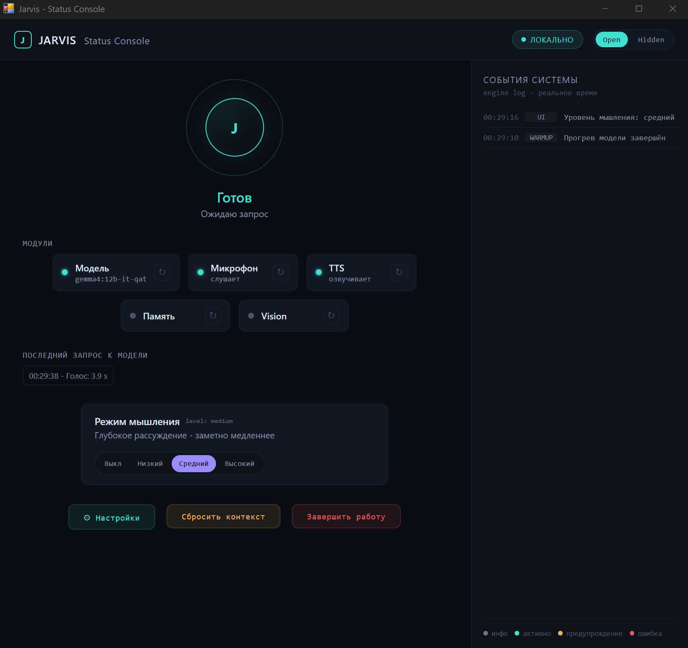
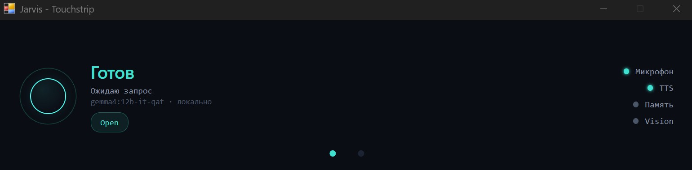
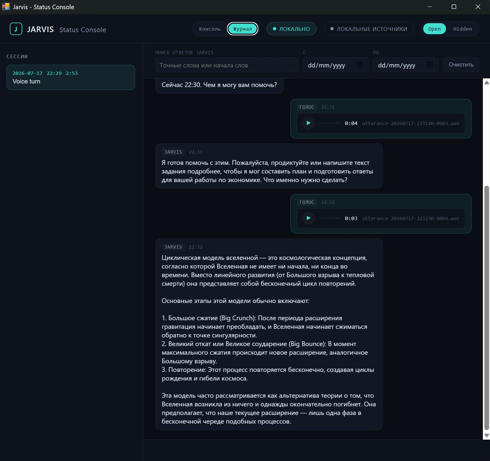

# Jarvis

Jarvis - локальный голосовой и визуальный ассистент для Windows-рабочей
станции. Он слушает микрофон, отправляет аудио и опциональные скриншоты в
локальную Ollama-модель и озвучивает ответы через настраиваемые локальные TTS
routes.

Ядро Jarvis рассчитано на работу без доступа к сети после одноразовой
подготовки. LLM backend - отдельный компонент: по умолчанию поддерживается
локальный сервер Ollama на той же машине, но выбранный backend, установка
моделей, обновления или будущий нелокальный провайдер могут иметь собственные
сетевые требования.

[English README](README.md)

## Status Console UI

В v1.5.2 Status Console развивается в Control Center и постоянный Dialog Journal: состояние runtime и
здоровье модулей, метаданные последнего запроса к модели с timestamp в начале,
события движка, уровни reasoning (Off/Low/Medium/High), Open/Hidden, сброс
контекста, защищённый Shutdown, типизированные restart-to-apply настройки
(модель, микрофон, TTS routes, язык UI и VAD), текстовый ввод из Journal,
копирование ответов, thumbnails скриншотов, ручное управление размером journal
и компактная touchstrip панель.
Начиная с v1.2.11 интерфейс по умолчанию английский; русский включается через
`[ui].language = "ru"` в `config.toml`.







## Статус

Это рабочий v1.5.2 hobby/research release с проверенным двуязычным TTS: русский
текст озвучивает Silero, английский - Piper, а потоковый ответ автоматически
маршрутизируется по набору символов. TTS-движок и локальная voice model
настраиваются отдельно для каждого языка. Совместимый zero-config default
использует только русский Silero; грубая транслитерация латиницы в нём - это
fallback для пользователей, которые не настроили английский Piper route, а не
рекомендуемая двуязычная конфигурация.

Текущий релиз также поддерживает четыре уровня reasoning Ollama и передаёт в
каждый принятый запрос локальные дату, день недели, время и UTC offset. Reasoning
trace не попадает в обычный ответ, TTS, историю, текст UI или логи.

Главные оставшиеся ограничения - отсутствие полноценного эхоподавления и
несовершенный OCR плотных скриншотов.

Jarvis не связан с Marvel, Disney или правообладателями связанных товарных знаков.

## Возможности

- Локальный Ollama backend с `gemma4:12b-it-qat`.
- Голосовой ввод через Silero VAD.
- Потоковый TTS на уровне предложений с настраиваемыми Silero/Piper routes по
  языкам.
- Захват полного экрана и выделенной области.
- Интерфейс на горячих клавишах и звуковых сигналах.
- Control Center UI: data-driven здоровье модулей, метаданные последнего
  запроса с timestamp в начале (без содержимого запроса), события системы,
  уровни reasoning, Open/Hidden, сброс контекста, защищённый Shutdown,
  типизированные restart-to-apply настройки и touchstrip glance surface. Язык
  интерфейса по умолчанию английский; русский включается через `[ui].language
  = "ru"` в `config.toml` (это касается только UI - язык диалога и TTS не
  меняются).
- Постоянный Dialog Journal с JSONL-логами по сессиям, текстовыми сообщениями
  Jarvis, копированием ответов, локальным воспроизведением аудио, thumbnails
  скриншотов, live-feed, поиском ответов Jarvis, фильтром по датам, отображением
  размера на диске, ручным удалением сессий и защитой Hidden. Медиа отдаётся
  через авторизованный локальный transport; русский поиск использует точное
  совпадение и префиксы.
- Контекст текущих локальных даты, дня недели, времени и числового UTC offset
  для каждого запроса без сохранения этого контекста в истории диалога.
- Асинхронная event-bus архитектура с изолированными модулями.
- TOML-конфигурация с проверкой типов, включая диалоговые промпты:
  системный промпт и запрос прогрева задаются секцией `[prompts]` в
  `config.toml` (по умолчанию - русские), так что язык диалога ассистента
  меняется без правки исходников.
- Runtime ядра Jarvis не зависит от сети после загрузки моделей.

## Требования

- Windows 11.
- Python 3.11.
- Установленный и запущенный Ollama.
- GPU с достаточным VRAM для выбранной Ollama-модели.

## Установка

Склонируйте репозиторий и установите Python-зависимости:

```bash
pip install -r requirements.txt
```

Загрузите Ollama-модель:

```bash
ollama pull gemma4:12b-it-qat
```

Один раз загрузите и закешируйте используемую по умолчанию модель Silero TTS:

```bash
python setup_tts_model.py
```

Для другой настроенной модели Silero передайте её язык и имя из manifest,
например `python setup_tts_model.py --language en --model v3_en`.

При необходимости создайте локальный config:

```cmd
copy config.example.toml config.toml
```

## Использование

Запускайте из корня репозитория:

```bash
python -m jarvis
```

Запуск с живым Status Console UI:

```bash
python -m jarvis --status-console
```

Только desktop-консоль, без touchstrip-окна:

```bash
python -m jarvis --status-console --no-touchstrip
```

Jarvis регистрирует конкретные сочетания через Windows `RegisterHotKey`.
Все сочетания проверены из другого приложения без прав администратора;
прежний глобальный key hook больше не используется.

Горячие клавиши по умолчанию:

- `Ctrl+Alt+S`: захватить весь экран для следующего запроса.
- `Ctrl+Alt+R`: захватить выделенную область экрана для следующего запроса.
- `Ctrl+Alt+V`: отправить текст из clipboard как новый turn.
- `Ctrl+Alt+M`: переключить sleep/wake микрофона.
- `Ctrl+Alt+T`: переключать reasoning по кругу Off, Low, Medium, High и снова Off.
- `Ctrl+Alt+Q`: выключить Jarvis.

## Опциональные MCP-примеры: DDGS и Qdrant

MCP остаётся выключенным, пока `[mcp].enabled` не включён явно. Готовый пример
публикует только два канонических инструмента: `web_search` через DDGS с
зафиксированным набором backend
`duckduckgo,wikipedia,brave,mojeek,yahoo,yandex` и read-only
`search_local_knowledge` через Qdrant. Провайдеры ставятся в отдельные virtual
environments, поэтому зафиксированные зависимости Qdrant не меняют основное
окружение Jarvis:

```powershell
python -m venv .venv-mcp-ddgs
& .\.venv-mcp-ddgs\Scripts\python.exe -m pip install "ddgs[mcp]==9.14.4"
python -m venv .venv-mcp-qdrant
& .\.venv-mcp-qdrant\Scripts\python.exe -m pip install "mcp-server-qdrant==0.8.1"
& .\.venv-mcp-qdrant\Scripts\python.exe tools\seed_qdrant_demo.py
Copy-Item examples\mcp\config.ddgs-qdrant-local.toml config.toml
python -m jarvis --status-console
```

При первом seed загружается настроенная модель FastEmbed. Для пересоздания
существующей коллекции нужен явный `--replace`. Для Qdrant без авторизации в
LAN выполните seed с `--url http://HOST:6333`, измените placeholder URL в
`config.ddgs-qdrant-lan.toml` и используйте этот профиль. При копировании или
слиянии профиля сохраните свои настройки вне MCP и проверьте `config.ui.toml`:
сохранённый там `[mcp].enabled` имеет приоритет над `config.toml`. DDGS
9.14.4 жёстко использует `POST` для текстового поиска DuckDuckGo, который при
ручной проверке возвращал пустой результат. Поэтому профили запускают
`examples/mcp/ddgs_get_mcp.py`: он переключает только этот процесс провайдера
на `GET` перед запуском штатного DDGS MCP server. После того как вариант только
с GET также не прошёл ручную проверку, профили получили явный набор backend из
DDGS issue #390. DDGS агрегирует этот набор, а не гарантирует строгий порядок
fallback. Launcher проверяет наличие всего набора при запуске, не изменяет
virtual environment и не включает открытый режим `auto`. Контракты поисковых
сервисов остаются неофициальными, поэтому дальнейшие поломки провайдера
возможны. Точный ручной checklist выводится командами:

```powershell
python -m manual.manual_check_mcp_providers --profile local
python -m manual.manual_check_mcp_providers --profile lan
```

## Архитектура

Устанавливаемый пакет приложения находится в `src/jarvis/`. Запускайте его из
корня репозитория через `python -m jarvis`; production-модули не импортируются
изменением `sys.path`. Приложение разделено на небольшие asyncio-модули,
связанные через `bus.py`:

- `audio_in.py`: микрофон, VAD, нарезка высказываний.
- `backend.py`: streaming adapter для Ollama `/api/chat`.
- `capture.py`: захват скриншотов.
- `tts.py`: буферизация предложений, настраиваемая маршрутизация Silero/Piper,
  воспроизведение.
- `sound_cues.py`: локально генерируемые звуковые сигналы.
- `config.py`: TOML-настройки и валидация, включая диалоговые промпты
  (`[prompts]`) и язык интерфейса (`[ui]`).
- `main.py`: wiring, orchestration, shutdown.

`PROJECT.md` - источник истины для архитектурных решений и проверенных экспериментов. Каталог `tasks/` хранит story cards, task cards и bug reports процесса разработки.

## Процесс Разработки

Репозиторий строился в agent-assisted workflow: факты проекта фиксировались в `PROJECT.md`, реализация дробилась на task cards, а day-0 эксперименты сохранялись как проверенные ограничения, чтобы не переоткрывать их заново. Эта история оставлена публичной намеренно: она показывает инженерные компромиссы v1.0 вокруг локальной мультимодальной модели, особенностей audio payload, горячих клавиш, TTS, задержек и известных рисков.

## Известные Проблемы

- Глобальные горячие клавиши используют Windows `RegisterHotKey` через
  `HotkeyProvider` и регистрируют только конкретные сочетания Jarvis. Прежняя
  зависимость от глобального key hook пакета Python `keyboard` удалена.
  Захват полного экрана и области, clipboard submit, sleep/wake микрофона,
  уровни reasoning, сообщение о конфликте и shutdown проверены глобально без
  elevation.
- В Status Console есть защищённый Shutdown control (на десктопе - клик и
  подтверждение; на touchstrip - удержание ~2с), который идёт через тот же
  штатный shutdown path, что и hotkey `Ctrl+Alt+Q`: оба варианта одинаково
  останавливают движок (фоновые задачи, TTS/звуковые сигналы, подписки на
  шину, hotkeys), а затем закрывают живые WebView-окна. `Ctrl+C` из терминала
  по-прежнему не является надёжным способом остановки, пока foreground UI
  loop принадлежит `pywebview`.
- Настоящий холодный старт Ollama может требовать увеличенного read timeout.
- Для journal пока нет автоматического retention/pruning: старые логи, аудио и
  скриншоты нужно удалять вручную через controls удаления сессий до принятия
  политики роста диска.
- При закрытии Status Console возможна гонка shutdown микрофона с blocking
  executor read; см. [открытый bug report](tasks/bug_reports/2026-07-17-shutdown-microphone-executor-race.md).
- В v1.0 нет полноценного эхоподавления. Jarvis может услышать собственный TTS через колонки; в коде есть cooldown mitigation, но это не полный fix.
- Silero TTS `v3_1_ru` не поддерживает латинские символы. Jarvis перед синтезом грубо транслитерирует латиницу в кириллицу.
- Плотные скриншоты, особенно большие IDE-окна, могут приводить к OCR-конфабуляциям. Для точечных вопросов лучше использовать region capture.
- Выбор области сейчас создаёт Tkinter overlay из callback thread горячей
  клавиши. Защитная проверка закрывает наблюдавшийся сбой порядка callbacks,
  но исправление threading-архитектуры остаётся отдельной backlog-задачей.
- Захват DirectX-приложений пока не является поддерживаемой гарантией. Работа
  в оконном и borderless-windowed режимах требует отдельного spike по capture
  backend; сбой такого захвата не означает проблему с hotkey.

## Тесты

Автоматические тесты покрывают только чистую логику: поведение шины событий, буферизация предложений, построение запросов, VAD-нарезка на записанных wav-фикстурах, парсинг конфига и подобное. Запуск локально:

```bash
python -m pytest
```

GitHub Actions (`.github/workflows/ci.yml`) при каждом push и pull request
выполняет `python -m ruff format --check .`, `python -m ruff check .` и
`python -m pytest`. CI не запускает Ollama, не скачивает модели, не трогает
секреты и не задействует железо.

Проверки, зависящие от железа и live-сервисов, остаются ручными и никогда не становятся CI-джобами: микрофон, колонки, глобальные hotkeys, screen capture, GPU/VRAM, визуальный обзор WebView и live Ollama endpoint. Запускайте ручные проверки из корня репозитория как модули, например `python -m manual.manual_check_status_console`; для day-0 используется `python -m manual.day0_checks`. Чистые тесты helpers для этих скриптов лежат в `manual/tests/`.

Зелёный прогон CI доказывает только то, что чистый набор тестов проходит при чистой установке зависимостей. Он не доказывает, что работающее приложение свободно от сетевых вызовов во время выполнения - это архитектурная гарантия, проверяемая код-ревью (см. `PROJECT.md`), а не то, что измеряет набор pytest.

## Лицензирование

Код проекта опубликован под MIT License. См. [LICENSE](LICENSE).

Внешние веса моделей не распространяются этим репозиторием и регулируются собственными лицензиями и условиями:

- Silero VAD опубликован upstream-проектом под MIT.
- Silero TTS модели регулируются лицензией Silero Models; текущая `v3_1_ru` модель не входит в MIT-лицензию этого репозитория.
- Веса Gemma регулируются условиями Google Gemma или конкретной лицензией модели, которую пользователь запускает через Ollama.

Перед коммерческим использованием или распространением проверьте upstream-лицензии моделей.
