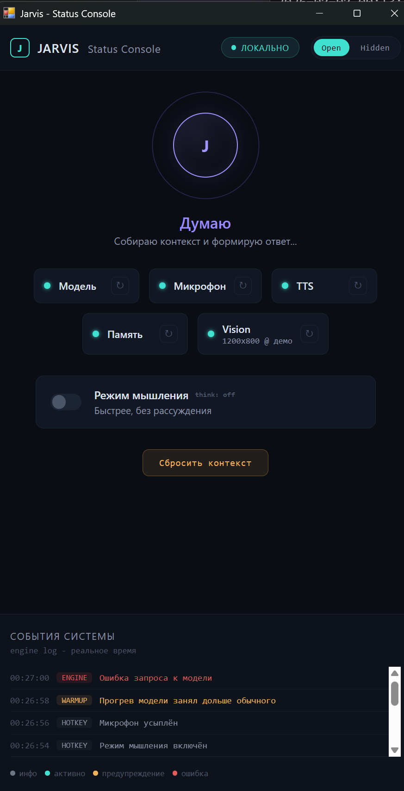
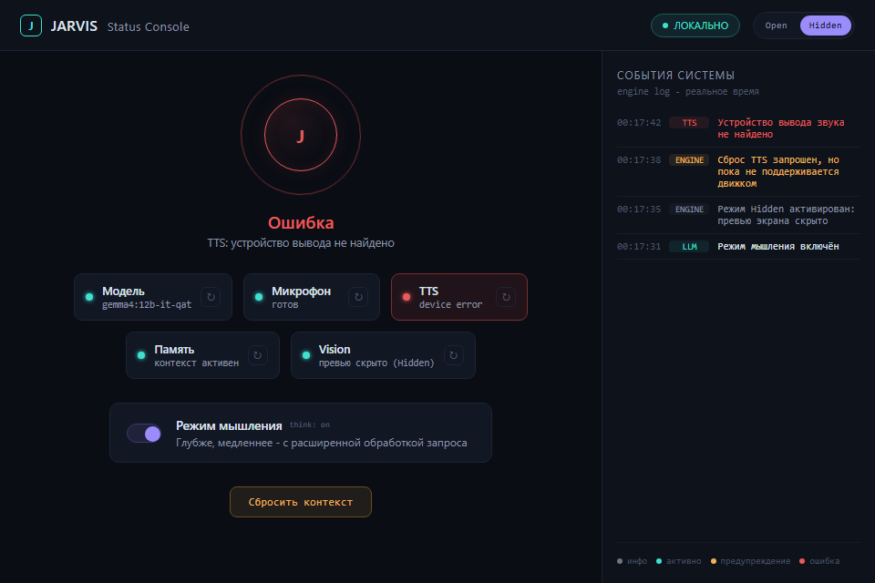
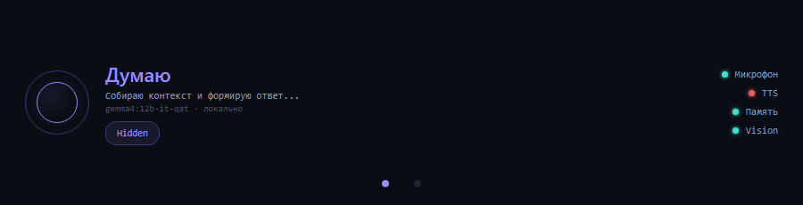

# Jarvis

Jarvis - локальный голосовой и визуальный ассистент для Windows-рабочей станции. Он слушает микрофон, отправляет аудио и опциональные скриншоты в локальную Ollama-модель и отвечает короткой русской речью через локальный TTS.

Ядро Jarvis рассчитано на работу без доступа к сети после одноразовой
подготовки. LLM backend - отдельный компонент: по умолчанию поддерживается
локальный сервер Ollama на той же машине, но выбранный backend, установка
моделей, обновления или будущий нелокальный провайдер могут иметь собственные
сетевые требования.

[English README](README.md)

## Status Console UI

В v1.2 появился локальный desktop Status Console: состояние runtime, события
движка, Think mode, режим Open/Hidden, сброс контекста и компактная touchstrip
панель.







## Статус

Это v1.2 hobby/research release. Проект рабочий, но честно оставляет ограничения видимыми: нет полноценного эхоподавления, TTS на Silero пока русскоязычный, латиница озвучивается через грубую транслитерацию, а OCR плотных скриншотов может ошибаться.

Jarvis не связан с Marvel, Disney или правообладателями связанных товарных знаков.

## Возможности

- Локальный Ollama backend с `gemma4:12b-it-qat`.
- Голосовой ввод через Silero VAD.
- Потоковый TTS на уровне предложений для меньшей воспринимаемой задержки.
- Захват полного экрана и выделенной области.
- Интерфейс на горячих клавишах и звуковых сигналах.
- Локальный Status Console UI: события системы, Think mode, Open/Hidden,
  сброс контекста и touchstrip glance surface.
- Асинхронная event-bus архитектура с изолированными модулями.
- TOML-конфигурация с проверкой типов.
- Runtime ядра Jarvis не зависит от сети после загрузки моделей.

## Требования

- Windows 11.
- Python 3.11.
- Установленный и запущенный Ollama.
- GPU с достаточным VRAM для выбранной Ollama-модели.
- Терминал с правами администратора для глобальных горячих клавиш Windows.

## Установка

Склонируйте репозиторий и установите Python-зависимости:

```bash
pip install -r requirements.txt
```

Загрузите Ollama-модель:

```bash
ollama pull gemma4:12b-it-qat
```

Один раз загрузите и закешируйте модель Silero TTS:

```bash
python setup_tts_model.py
```

При необходимости создайте локальный config:

```cmd
copy config.example.toml config.toml
```

## Использование

Запускайте из корня репозитория:

```bash
python main.py
```

Запуск с живым Status Console UI:

```bash
python main.py --status-console
```

Только desktop-консоль, без touchstrip-окна:

```bash
python main.py --status-console --no-touchstrip
```

Чтобы глобальные горячие клавиши работали из любого приложения Windows, запускайте терминал от администратора. Без elevation горячие клавиши могут срабатывать только когда окно терминала Jarvis находится в фокусе.

Горячие клавиши по умолчанию:

- `Ctrl+Alt+S`: захватить весь экран для следующего запроса.
- `Ctrl+Alt+R`: захватить выделенную область экрана для следующего запроса.
- `Ctrl+Alt+Q`: выключить Jarvis.

## Архитектура

Приложение разделено на небольшие asyncio-модули, связанные через `bus.py`:

- `audio_in.py`: микрофон, VAD, нарезка высказываний.
- `backend.py`: streaming adapter для Ollama `/api/chat`.
- `capture.py`: захват скриншотов.
- `tts.py`: буферизация предложений, Silero TTS, воспроизведение.
- `sound_cues.py`: локально генерируемые звуковые сигналы.
- `config.py`: TOML-настройки и валидация.
- `main.py`: wiring, orchestration, prompt, shutdown.

`PROJECT.md` - источник истины для архитектурных решений и проверенных экспериментов. Каталог `tasks/` хранит story cards, task cards и bug reports процесса разработки.

## Процесс Разработки

Репозиторий строился в agent-assisted workflow: факты проекта фиксировались в `PROJECT.md`, реализация дробилась на task cards, а day-0 эксперименты сохранялись как проверенные ограничения, чтобы не переоткрывать их заново. Эта история оставлена публичной намеренно: она показывает инженерные компромиссы v1.0 вокруг локальной мультимодальной модели, особенностей audio payload, горячих клавиш, TTS, задержек и известных рисков.

## Известные Проблемы

- Глобальные горячие клавиши Windows требуют прав администратора.
- В live-режиме Status Console пока нет Shutdown control. В этом режиме
  `Ctrl+C` из терминала больше не является надёжным способом остановки,
  потому что foreground UI loop принадлежит `pywebview`; пока запланированный
  Shutdown control не реализован, при недоступности shutdown-hotkey Jarvis
  приходится завершать через процесс Python.
- Настоящий холодный старт Ollama может требовать увеличенного read timeout.
- В v1.0 нет полноценного эхоподавления. Jarvis может услышать собственный TTS через колонки; в коде есть cooldown mitigation, но это не полный fix.
- Silero TTS `v3_1_ru` не поддерживает латинские символы. Jarvis перед синтезом грубо транслитерирует латиницу в кириллицу.
- Плотные скриншоты, особенно большие IDE-окна, могут приводить к OCR-конфабуляциям. Для точечных вопросов лучше использовать region capture.

## Тесты

Автоматические тесты покрывают только чистую логику. Проверки микрофона, колонок, глобальных hotkeys, screenshots, VRAM и live Ollama endpoint по проектной политике выполняются вручную.

```bash
python -m pytest
```

## Лицензирование

Код проекта опубликован под MIT License. См. [LICENSE](LICENSE).

Внешние веса моделей не распространяются этим репозиторием и регулируются собственными лицензиями и условиями:

- Silero VAD опубликован upstream-проектом под MIT.
- Silero TTS модели регулируются лицензией Silero Models; текущая `v3_1_ru` модель не входит в MIT-лицензию этого репозитория.
- Веса Gemma регулируются условиями Google Gemma или конкретной лицензией модели, которую пользователь запускает через Ollama.

Перед коммерческим использованием или распространением проверьте upstream-лицензии моделей.
