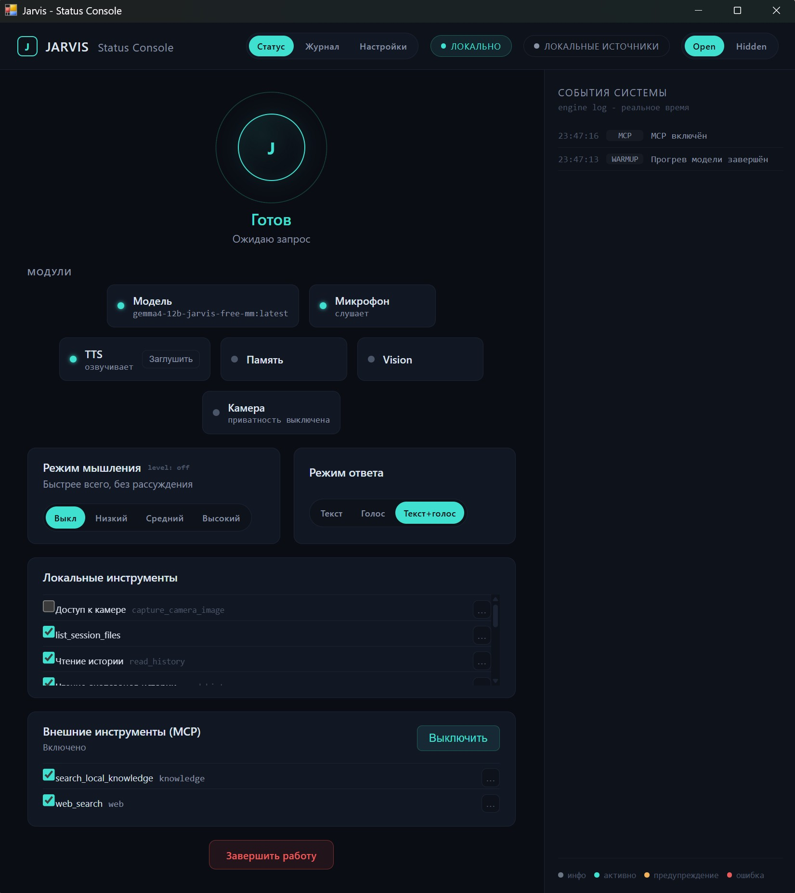
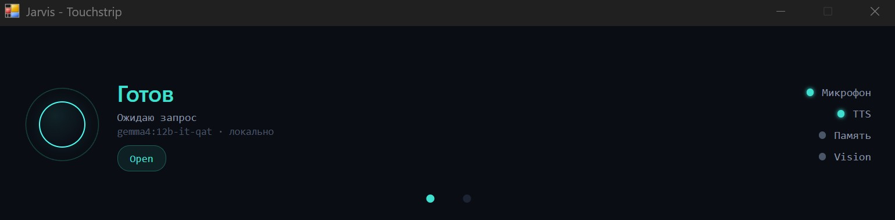
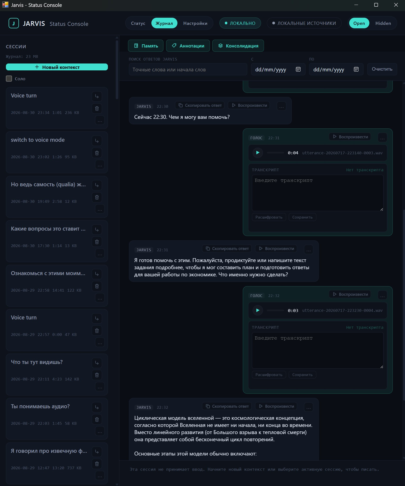

# Jarvis

Jarvis - локальный голосовой и визуальный ассистент для Windows-рабочей
станции. Он слушает микрофон, отправляет аудио и опциональные скриншоты в
локальную Ollama-модель и озвучивает ответы через настраиваемые локальные TTS
routes.

Ядро Jarvis рассчитано на работу без доступа к сети после одноразовой
подготовки. LLM backend - отдельный компонент: по умолчанию поддерживается
локальный сервер Ollama на той же машине, но выбранный backend, установка
моделей, обновления или будущий нелокальный провайдер могут иметь собственные
сетевые требования.

[English README](README.md)

## Status Console UI

Начиная с v1.6.3 консоль разделена на три вкладки - по природе данных, а не по
типу виджета:

- **Статус** - живое состояние движка и действия, срабатывающие сразу:
  состояние runtime и здоровье модулей, метаданные последнего запроса к модели
  с timestamp в начале, уровни reasoning (Off/Low/Medium/High), переключатель
  режима ответа (Text-Only / TTS-Only / Text+TTS; см.
  [Режимы ответа](#режимы-ответа)), внешние инструменты (MCP) со списком
  tools, события движка и защищённый Shutdown. Панель событий также показывает
  запрос каждого хода к модели на языке интерфейса - см.
  [Логи и диагностику](#логи-и-диагностика).
- **Журнал** - поверхность диалога: постоянный лог, текстовый ввод с локальными
  file attachments, копирование ответов, thumbnails скриншотов, ручное
  управление размером journal, session fork, редактируемые файлы curated memory
  и явное действие "Новый контекст".
- **Настройки** - холодная конфигурация, restart-to-apply: модель, микрофон,
  режим ответа (сохраняемое значение по умолчанию для следующего запуска),
  язык UI, TTS routes и VAD.

Шапка одинакова на всех вкладках: индикаторы честности `LOCAL` и
`LOCAL SOURCES` и переключатель Open/Hidden не исчезают при смене вкладки.
Локальные builtin tools для делегированного изменения reasoning и памяти и
компактная touchstrip панель работают как прежде.
Начиная с v1.2.11 интерфейс по умолчанию английский; русский включается через
`[ui].language = "ru"` в `config.toml`.







## Статус

Это рабочий v1.6.1 hobby/research release с проверенным двуязычным TTS: русский
текст озвучивает Silero, английский - Piper, а потоковый ответ автоматически
маршрутизируется по набору символов. TTS-движок и локальная voice model
настраиваются отдельно для каждого языка. Совместимый zero-config default
использует только русский Silero; грубая транслитерация латиницы в нём - это
fallback для пользователей, которые не настроили английский Piper route, а не
рекомендуемая двуязычная конфигурация.

Текущий релиз также поддерживает четыре уровня reasoning Ollama и передаёт в
каждый принятый запрос локальные дату, день недели, время и UTC offset. Reasoning
trace не попадает в обычный ответ, TTS, историю, текст UI или логи.

Главные оставшиеся ограничения - отсутствие полноценного эхоподавления и
несовершенный OCR плотных скриншотов.

Jarvis не связан с Marvel, Disney или правообладателями связанных товарных знаков.

## Возможности

- Локальный Ollama backend с `gemma4:12b-it-qat`.
- Голосовой ввод через Silero VAD.
- Потоковый TTS на уровне предложений с настраиваемыми Silero/Piper routes по
  языкам.
- Захват полного экрана и выделенной области.
- Интерфейс на горячих клавишах и звуковых сигналах.
- Control Center UI: data-driven здоровье модулей, метаданные последнего
  запроса с timestamp в начале (без содержимого запроса), события системы,
  уровни reasoning, Open/Hidden, сброс контекста, защищённый Shutdown,
  типизированные restart-to-apply настройки и touchstrip glance surface. Язык
  интерфейса по умолчанию английский; русский включается через `[ui].language
  = "ru"` в `config.toml` (это касается только UI - язык диалога и TTS не
  меняются).
- Постоянный Dialog Journal с JSONL-логами по сессиям, текстовыми сообщениями
  и локальными file attachments для Jarvis, копированием ответов, локальным
  воспроизведением аудио, thumbnails скриншотов, live-feed, поиском ответов
  Jarvis, фильтром по датам, отображением размера на диске, ручным удалением
  сессий, session fork ("продолжить этот разговор"), явным созданием пустого
  контекста, редактируемыми файлами `memory.md`/`self.md` и защитой Hidden.
  Медиа и файлы памяти отдаются через авторизованный локальный transport;
  поиск в Journal использует тот же гибридный retrieval, что описан в разделе
  [Неограниченная история диалога](#неограниченная-история-диалога) ниже.
- Повторное воспроизведение из Журнала: кнопка Play на каждом
  воспроизводимом ходе проигрывает его и все последующие воспроизводимые ходы
  сессии подряд. Ответ ассистента заново синтезируется через TTS по требованию
  (аудио не хранится - это свежий синтез с текущими настройками голоса/скорости
  TTS, так что ранее произнесённый ответ можно переслушать уже другим голосом);
  голосовой запрос играет свою оригинальную запись, так что вы слышите
  собственный голос, а не ре-синтез. Печатные запросы и системные события
  пропускаются. Play на ходе у конца проигрывает только его; старт выше по
  ленте проигрывает остаток разговора по порядку, а текущий ход подсвечивается
  по мере продвижения воспроизведения. Пауза/Продолжить приостанавливает и
  продолжает текущий ход, не теряя позицию. Replay использует единственный
  канал воспроизведения: нажатие Play, пока Jarvis уже говорит (живой ход или
  другой replay), отклоняется звуковым сигналом ошибки и сообщением, а не
  ставится в очередь - и его можно просто нажать снова, когда канал
  освободится. Кнопка переключается в Stop во время проигрывания; новый живой
  ход, `Ctrl+Alt+I` и отключение TTS останавливают идущий replay.
- Три переключаемых режима ответа (полные trade-offs - в разделе
  [Режимы ответа](#режимы-ответа)):
  - **Text-Only** (по умолчанию, текущее поведение): один проход, ответ
    стримится на экран, а существующий sentence-buffered TTS озвучивает его
    по мере поступления.
  - **TTS-Only**: один проход, модель просится на самодостаточный устный
    ответ - связная проза без списков, таблиц и URL; на экран ничего не
    выводится, поэтому устная форма ни на что внешнее не ссылается.
  - **Text + voice** - это не просто "тот же ответ ещё и голосом", а
    ключевой режим "текстовый канвас + голосовая проводка": сначала Jarvis
    стримит на экран канонический богатый ответ, затем отдельным вторым
    проходом без reasoning произносит производный комментарий к уже
    видимому тексту. Это осознанно альтернативно минимальной задержке (см.
    описание режима ниже): голос ждёт завершения первого прохода и ещё
    одного локального запроса к модели, зато пользователь получает
    одновременно инспектируемый текст и слышимое сопровождение к нему. В
    retrieval/memory попадает только канонический текст; произнесённая
    производная хранится в Journal под тем же ходом как "озвучено", но не
    считается самостоятельным источником фактов.
- Неограниченная история диалога: обычный запрос к Ollama остаётся
  ограниченным по размеру независимо от того, насколько вырос локальный
  журнал. См.
  [Неограниченная история диалога](#неограниченная-история-диалога).
- Journal attachments действуют только в текущем turn и остаются локальными.
  Первая итерация поддерживает один текстовый файл (`.txt`, `.md`, `.csv`,
  `.json`, `.log`, UTF-8, upload cap 2 MB, 20000 символов в model-facing
  тексте), до четырёх изображений (`.png`, `.jpg`, `.jpeg`, 15 MB каждое) и
  один аудиофайл (`.wav`, `.mp3`, 20 MB, до 90 s с нарезкой на клипы по 30 s).
  В одном turn максимум четыре прикреплённых файла и 40 MB file bytes. Hidden
  очищает ожидающие выбора файлы и запрещает upload submit.
- Локальные builtin tools позволяют Jarvis через audited tool path менять свой
  reasoning level для следующего turn и append/replace пользовательски
  проверяемых файлов `memory.md` / `self.md`. Эти tools остаются локальными и
  не зависят от optional MCP module; успешный builtin replace сохраняет
  предыдущую версию как `memory.md.bak` или `self.md.bak`; privacy controls
  вроде microphone sleep, Open/Hidden и MCP enablement не делегируются модели.
- Файлы сессии позволяют Jarvis сохранять и перечитывать файлы в рамках
  текущей сессии диалога. Через audited tool path модель может записать
  текстовый файл, прочитать текст обратно, посмотреть PNG/JPEG-изображение и
  получить метаданные/список. Запись только create-only: модель не
  перезаписывает, не удаляет и не переименовывает, а запрошенное имя
  превращается в сгенерированный storage-хэндл (`name-<id>.ext`), которым
  пользуются последующие чтения - нет удаления по файлу, переименования и
  произвольного доступа между сессиями. Продолженная сессия может читать (не
  писать) файлы, унаследованные от сессии, которую она продолжила. Также можно
  отметить вложение галочкой «Оставить в сессии», чтобы сохранить его как файл
  сессии и передать хэндл модели. Файлы сессии - обычные файлы рядом с
  журналом, вне транскрипта и индекса истории, и удаляются вместе со своей
  сессией. См. [Файлы сессии](#файлы-сессии).
- Съёмка кадра по запросу с именованных USB- и LAN-источников (RTSP),
  выключенная по умолчанию и закрытая неделегируемым переключателем. Кадры
  живут только в текущем ходе, каждый кадр остаётся привязан к своему
  источнику, LAN-съёмка отражается как `lan` на оси источников данных. См.
  [Камера](#камера).
- Контекст текущих локальных даты, дня недели, времени и числового UTC offset
  для каждого запроса без сохранения этого контекста в истории диалога.
- Локальный системный лог с ограниченной ротацией для диагностики постфактум
  и локализованная запись о запросе каждого хода в панели событий консоли.
  Ни одна из записей не содержит содержимого запроса.
- Асинхронная event-bus архитектура с изолированными модулями.
- TOML-конфигурация с проверкой типов, включая диалоговые промпты:
  системный промпт и запрос прогрева задаются секцией `[prompts]` в
  `config.toml` (по умолчанию - русские), так что язык диалога ассистента
  меняется без правки исходников.
- Runtime ядра Jarvis не зависит от сети после загрузки моделей.

## Требования

- Windows 11.
- Python 3.11.
- Установленный и запущенный Ollama.
- GPU с достаточным VRAM для выбранной Ollama-модели.

## Установка

Склонируйте репозиторий и установите Python-зависимости:

```bash
pip install -r requirements.txt
```

Загрузите Ollama-модель:

```bash
ollama pull gemma4:12b-it-qat
```

Один раз загрузите и закешируйте используемую по умолчанию модель Silero TTS:

```bash
python setup_tts_model.py
```

Для другой настроенной модели Silero передайте её язык и имя из manifest,
например `python setup_tts_model.py --language en --model v3_en`.

При необходимости создайте локальный config:

```cmd
copy config.example.toml config.toml
```

## Диалоговые и reasoning-промпты

`[prompts].system` задаёт базовый диалоговый промпт, а `[prompts].warmup` -
одноразовый запрос прогрева при запуске. Необязательные секции
`reasoning_low`, `reasoning_medium` и `reasoning_high` добавляют инструкции
только для уровней Low, Medium и High. У режима Off отдельной секции нет.

Каждая reasoning-секция может быть inline-текстом или ссылкой вида
`@file-path`:

```toml
[prompts]
reasoning_low = "Подумай кратко, затем ответь прямо."
reasoning_medium = "@/reasoning/medium.md"
reasoning_high = "@reasoning/high.md"
```

`@` - синтаксис только для промптов: ссылка всегда разрешается внутри
`./.jarvis/`, а не от корня файловой системы. Например,
`@/reasoning/medium.md` читает `./.jarvis/reasoning/medium.md`. Компонент
`..` запрещён; отсутствующий, нечитаемый, не-UTF-8, являющийся каталогом или
пустой файл останавливает запуск с ошибкой конфигурации. Литерал, начинающийся
с `@`, не поддерживается, потому что `@` всегда означает file reference.

Для каждого принятого хода Jarvis собирает базовый системный промпт, затем
материал сессии из `self.md` и `memory.md`, затем секцию для sampled reasoning
level этого хода. Переключение уровня во время выполняющегося хода влияет
только на следующий ход.

## Использование

Запускайте из корня репозитория:

```bash
python -m jarvis
```

Запуск с живым Status Console UI:

```bash
python -m jarvis --status-console
```

Только desktop-консоль, без touchstrip-окна:

```bash
python -m jarvis --status-console --no-touchstrip
```

Jarvis регистрирует конкретные сочетания через Windows `RegisterHotKey`.
Все сочетания проверены из другого приложения без прав администратора;
прежний глобальный key hook больше не используется.

Горячие клавиши по умолчанию:

- `Ctrl+Alt+S`: захватить весь экран для следующего запроса.
- `Ctrl+Alt+R`: захватить выделенную область экрана для следующего запроса.
- `Ctrl+Alt+V`: отправить текст из clipboard как новый turn.
- `Ctrl+Alt+M`: переключить sleep/wake микрофона.
- `Ctrl+Alt+T`: переключать reasoning по кругу Off, Low, Medium, High и снова Off.
- `Ctrl+Alt+O`: переключать режим ответа по кругу Text-Only, TTS-Only,
  Text + voice и снова Text-Only (живое изменение, только на текущую сессию
  - см. [Режимы ответа](#режимы-ответа)).
- `Ctrl+Alt+I`: прервать текущий ответ, остановить воспроизведение речи и
  генерацию backend, затем вернуть Jarvis к прослушиванию. Также останавливает
  идущий повтор ответа (replay).
- `Ctrl+Alt+Q`: выключить Jarvis.

## Логи и диагностика

Jarvis ведёт две разные записи - для двух разных вопросов.

**Системный лог** отвечает на вопрос "что сломалось". Это подробный
англоязычный файл `logs/jarvis.log`, который пишется независимо от того,
запущен ли Jarvis из терминала, и остаётся на диске после выхода процесса.
**Именно этот файл нужно прикладывать к отчёту о проблеме.** Он ротируется на
2 МБ и хранит 5 предыдущих файлов, так что весь набор остаётся около 10 МБ и
не заполнит диск за долгую сессию. Каталог и обе границы настраиваются в
секции `[logging]` файла `config.toml`; настраивается именно каталог -
именами файлов распоряжается ротация. Если лог открыть не удалось, Jarvis
всё равно запускается и выдаёт предупреждение.

Лог никуда не уходит сам. Ни телеметрии, ни выгрузки, ни сетевого приёмника
нет - отправить его куда-либо можно только вручную, приложив файл.

**Панель событий** на вкладке "Статус" отвечает на вопрос "что Jarvis сейчас
делал", на языке интерфейса. Она показывает события движка и по одной записи
на ход о том, что этот ход отправил модели: голос с длительностью, скриншот,
буфер обмена, текстовый ввод или вложения. Это живое представление на 200
последних записей, которое очищается при переподключении, поэтому
диагностическим инструментом оно не является: падение до открытия окна не
оставит здесь ничего - ровно для этого и существует файловый лог.

Ни одна из записей не содержит того, что вы на самом деле сказали или
отправили. Обе ограничены видами, количествами, длительностями и размерами -
без расшифровок речи, без текста буфера обмена, без данных изображений и без
содержимого вложений. В панели событий дополнительно нет имён файлов, так что
оставленная открытой панель не раскрывает ничего из того, что должен скрывать
режим Hidden.

## Камера

Jarvis по запросу снимает один кадр - с локальной USB-камеры или с LAN-камеры
по RTSP - и отвечает на вопросы о том, что видит. Кадр попадает только в
текущий ход и никогда не записывается в историю диалога.

Доступ закрыт двумя переключателями, и оба принадлежат только вам:
`[camera].enabled` в `config.toml` и пункт `capture_camera_image` в списке
инструментов Status Console. Модель не может изменить ни один из них. Пока
камера выключена, кадр не снимается вообще - инструмент возвращает ошибку.
Каждый снимок сопровождается звуковым сигналом.

Камеры описываются списком именованных источников в `[[camera.sources]]` (см.
`config.example.toml`). Если список не задан, прежняя USB-конфигурация
продолжает работать без правок. Называйте источник по тому, что он показывает,
а не по тому, как он подключён, и описывайте честно: описание - это то, что
получает модель, и именно по нему она выбирает камеру, когда вы говорите
"посмотри в широкую камеру". Несколько камер в одном ходе снимаются несколькими
вызовами инструмента, поэтому каждый кадр остаётся привязан к своему источнику.

USB-съёмка отражается на оси источников данных как `local`, LAN-съёмка - как
`lan`, точно так же как LAN-инструмент MCP. Ход, использовавший обе, показывает
более широкую из двух. Ни один путь камеры не обращается к облачным API: RTSP
идёт напрямую к камере в вашей сети.

### Настройка LAN-камеры

- **Сначала в приложении самой камеры.** Создайте учётную запись RTSP/медиа и
  выключите шифрование медиапотока. Без этого любой запрос будет возвращать
  `401`, что бы вы ни написали в конфиге.
- **Пароль хранится в `config.toml` открытым текстом.** Любой, кто может
  прочитать этот файл, может смотреть камеру и использовать пароль везде, где
  вы его повторили. Заведите для Jarvis отдельную учётную запись камеры и
  держите файл вне системы контроля версий и вне бэкапов. Как уйти от этого -
  открытый вопрос, а не принятое решение, см.
  [заметку в backlog](tasks/backlog/secret-storage.md).
- **Ничего не кодируйте вручную.** Хост, порт, пользователь, пароль и путь
  потока задаются отдельными значениями, URL собирает сам Jarvis, поэтому
  пароль с символами `#`, `/`, `@`, `:`, `?` или `&` пишется буквально. Готовый
  URL из инструкции к камере нельзя вставить одной строкой - это осознанная
  цена за устранение целого класса молчаливых сбоев.
- **Путь потока подбирается перебором.** Камеры обычно отвечают `401` на любой
  путь, пока не совпадут учётные данные, поэтому неверный путь и неверный
  пароль неотличимы. Используйте
  `python -m manual.manual_check_rtsp_discovery --host <ip> --user <user>` -
  это проверяет варианты за миллисекунды, а не за таймаут захвата на каждую
  попытку.

### Что камера умеет, а что нет

Описание сцены - поддерживаемый ответ: "что в комнате", "открыта ли дверь",
"что лежит на столе". Чтение текста и подсчёт объектов **не** гарантируются, и
режим отказа здесь самый опасный: на одной и той же футболке модель уверенно
прочитала "SONY" с одной линзы и правильное "BOSS" с другой, ни разу не
усомнившись. Любую надпись, число или количество с камеры считайте догадкой, а
не фактом.

Jarvis только читает кадры. Он не поворачивает моторизованную линзу и не
включает подсветку, даже если камера это умеет: такие действия меняют
физический мир, а не наблюдают его, и они закрыты отдельным будущим
разрешением, а не переключателем камеры. Обоснование - в
[заметке backlog](tasks/backlog/camera-world-changing-controls.md). Следствие,
которое стоит проговорить: моторизованная линза показывает туда, куда её
последний раз навели - в том числе автослежением самой камеры, - поэтому её
кадры невоспроизводимы, и описание источника должно об этом говорить.

## Файлы сессии

Jarvis может хранить файлы в рамках текущей сессии диалога и открывать их
позже. Через audited tool path модель может сохранить UTF-8 текстовый файл
(`write_session_file`), прочитать текст обратно (`read_session_text`),
посмотреть PNG- или JPEG-изображение (`view_session_image`) и получить
метаданные либо список (`stat_session_file`, `list_session_files`). Это
локальные builtins на оси источников данных `local`, как и инструменты памяти.

Запись только create-only, а запрошенное имя - это метка, а не идентичность.
Репозиторий превращает его в сгенерированный storage-хэндл - `notes-<id>.md`
для `notes.md`, - и именно этот хэндл использует любое последующее чтение,
просмотр или stat. Модель никогда не перезаписывает, не удаляет и не
переименовывает файл и не называет id сессии, поэтому не может добраться до
файлов другой сессии. Удаления по файлу нет; единственный способ убрать файлы
сессии - удалить всю сессию, что удаляет их вместе с ней.

Сессия, начатая продолжением другой, может читать (но не писать) файлы,
унаследованные от предков; они живые, поэтому удаление сессии-предка убирает
доступ продолженной сессии к ним. Поскольку у файла сессии нет журнального
события, он обнаруживается только по своему storage-хэндлу - попросите Jarvis
сделать `list_session_files`, чтобы увидеть, что в сессии есть.

Вложение из дока ввода журнала тоже можно сохранить: отметьте «Оставить в
сессии» перед отправкой, и файл копируется в сессию под сгенерированным
хэндлом, а его имя передаётся модели в том же ходе. Док показывает «Сохранено
как `<хэндл>`» или причину, если сохранить не удалось. Отметка «оставить» не
меняет поведение вложения в текущем ходе - отмеченное изображение всё равно
показывается модели в этом ходе.

Файлы сессии - обычные файлы рядом с журналом событий. Их содержимое не
попадает в транскрипт, производный корпус и индекс поиска истории. Размер
ограничен секцией `[files]` в `config.toml` (`max_text_write_chars`,
`max_text_read_bytes`, `max_image_view_bytes`), а `[files].write_ext_blacklist`
перечисляет расширения, которые модель не может создавать - это deny-list (всё
не перечисленное разрешено) из Windows-исполняемых/скриптовых типов по
умолчанию, которым владеете вы. См. `config.example.toml` для значений по
умолчанию и предупреждений.

## Опциональные MCP-примеры: DDGS и Qdrant

MCP остаётся выключенным, пока `[mcp].enabled` не включён явно. Готовый пример
публикует только два канонических инструмента: `web_search` через DDGS с
зафиксированным набором backend
`duckduckgo,wikipedia,brave,mojeek,yahoo,yandex` и read-only
`search_local_knowledge` через Qdrant. Провайдеры ставятся в отдельные virtual
environments, поэтому зафиксированные зависимости Qdrant не меняют основное
окружение Jarvis:

```powershell
python -m venv .venv-mcp-ddgs
& .\.venv-mcp-ddgs\Scripts\python.exe -m pip install "ddgs[mcp]==9.14.4"
python -m venv .venv-mcp-qdrant
& .\.venv-mcp-qdrant\Scripts\python.exe -m pip install "mcp-server-qdrant==0.8.1"
& .\.venv-mcp-qdrant\Scripts\python.exe tools\seed_qdrant_demo.py
Copy-Item examples\mcp\config.ddgs-qdrant-local.toml config.toml
python -m jarvis --status-console
```

При первом seed загружается настроенная модель FastEmbed. Для пересоздания
существующей коллекции нужен явный `--replace`. Для Qdrant без авторизации в
LAN выполните seed с `--url http://HOST:6333`, измените placeholder URL в
`config.ddgs-qdrant-lan.toml` и используйте этот профиль. При копировании или
слиянии профиля сохраните свои настройки вне MCP и проверьте `config.ui.toml`:
сохранённый там `[mcp].enabled` имеет приоритет над `config.toml`. DDGS
9.14.4 жёстко использует `POST` для текстового поиска DuckDuckGo, который при
ручной проверке возвращал пустой результат. Поэтому профили запускают
`examples/mcp/ddgs_get_mcp.py`: он переключает только этот процесс провайдера
на `GET` перед запуском штатного DDGS MCP server. После того как вариант только
с GET также не прошёл ручную проверку, профили получили явный набор backend из
DDGS issue #390. DDGS агрегирует этот набор, а не гарантирует строгий порядок
fallback. Launcher проверяет наличие всего набора при запуске, не изменяет
virtual environment и не включает открытый режим `auto`. Контракты поисковых
сервисов остаются неофициальными, поэтому дальнейшие поломки провайдера
возможны. Точный ручной checklist выводится командами:

```powershell
python -m manual.manual_check_mcp_providers --profile local
python -m manual.manual_check_mcp_providers --profile lan
```

## Режимы ответа

Ответ, полный списков, таблиц и ссылок, тяжело *слушать*, при этом часть
содержимого нельзя озвучить чисто и нельзя выбросить. Поэтому в Jarvis три
переключаемых режима ответа, а не одна "удобная для прослушивания" перезапись.
Режим - это сохраняемая настройка (`[response].mode` в `config.toml`, по
умолчанию `text`, так что поведение по умолчанию не меняется, пока вы сами
его не переключите).

- **Text-Only** (`text`) - по умолчанию и текущее поведение: один проход,
  канонический богатый ответ стримится на экран, и sentence-buffered TTS
  озвучивает его по мере поступления. Минимальная задержка.
- **TTS-Only** (`voice`) - один проход с *самодостаточным голосовым
  контрактом*: связная проза без списков, таблиц и URL, числа и единицы
  озвучиваются там, где это помогает. На экран ничего не выводится, поэтому по
  построению устный ответ ни на что внешнее не ссылается. Trade-off: в
  содержимом, для которого важен "нельзя-произнести-текстом" остаток (таблица,
  блок кода, длинный URL, точная выкладка), этот остаток будет потерян.
- **Text + voice** (`text_voice`) - ключевой режим "текстовый канвас +
  голосовая проводка" и осознанный обмен качества на задержку, а не путь
  оптимизации. Первый проход создаёт канонический текстовый канвас: полный
  богатый ответ, стримящийся на экран точно как в Text-Only. Второй проход -
  без reasoning, над точно этим показанным текстом - произносит производный
  комментарий к видимому содержимому, поэтому может сказать "как в таблице
  выше": таблица действительно на экране. Экран начинает стримиться сразу;
  только звук ждёт завершения первого прохода плюс ещё один локальный запрос
  к модели. Кому важна минимальная задержка на ответ - выбирают Text-Only или
  TTS-Only; Text + voice - добровольный выбор более богатого ответа-объекта
  плюс устного гида по нему. В Journal производная появляется свёрнутым
  блоком "озвучено" под тем же ходом, и только канонический текст попадает в
  историю, retrieval и память.

Переключение между режимами:

- **Горячая клавиша** `Ctrl+Alt+O` (`hotkeys.response_mode_toggle`, значение
  по умолчанию `src/jarvis/core/config.py:140`; переопределяется ключом
  `[hotkeys] response_mode_toggle` в `config.toml`) переключает по кругу
  Text-Only -> TTS-Only -> Text + voice -> Text-Only. Это живое изменение
  только на текущую сессию: сохраняет выбор не клавиша, а выпадающий список
  на вкладке настроек.
- **Вкладка Статус**: группа кнопок "Режим ответа" зеркалит горячую клавишу
  (живое изменение, текущая сессия). После нажатия клавиши текущий режим
  смотрите по кнопкам, а не по выпадающему списку настроек.
- **Вкладка Настройки**: выпадающий список "Режим ответа" - обычная форма
  restart-to-apply; выбор режима и нажатие "Применить" записывает его в
  `config.ui.toml`, задаёт значение для следующего запуска и не трогает
  текущую сессию.
- **Голосовая команда** (опционально, по умолчанию выключена): при настроенном
  `[prompts].voice_intent_directive` произнесённая команда "переключись на
  голосовой режим" (или текстовый/текст и голос) меняет живой режим и не
  считается содержимым запроса. Без этой директивы голосовые команды не
  распознаются, и голосовые ходы ведут себя ровно как раньше.

## Неограниченная история диалога

Jarvis может использовать полную локальную историю разговоров, даже если она
не помещается в контекстное окно Ollama. Обычный запрос к Ollama остаётся
ограниченным контекстом - инструкции, хвост недавних ходов, небольшой набор
релевантных найденных фрагментов и текущий запрос - независимо от того,
насколько вырос локальный журнал.

- **Гибридный retrieval, а не только точный поиск.** Поиск сочетает
  морфологически-осведомлённый лексический поиск (SQLite FTS5 плюс
  нормализатор `pymorphy3`, так что вариативность русских словоформ
  обрабатывается без модели) с локальным семантическим индексом фрагментов
  (`blaifa/multilingual-e5-large-instruct` через embedding endpoint Ollama по
  умолчанию). Лексический baseline был измерен до добавления слоя embeddings,
  и этот слой сохранён только потому, что он доказанно закрывает разрыв в
  recall на перефразированных/синонимичных запросах, которого лексический
  baseline не достигает - см. записи о spike выбора гибридного retrieval и о
  quality gate в `PROJECT.md`.
- **Фолбэк на точный/префиксный поиск.** Если семантический индекс
  недоступен (выключен, не построен, либо его сохранённый backend больше не
  совпадает с конфигурацией), retrieval автоматически откатывается на
  лексический поиск - имена, даты, идентификаторы и номера остаются
  находимыми и без семантического слоя.
- **Ограниченный бюджет retrieval на ход.** Автоматический retrieval
  запускается один раз на обычный ход, с измеренным дедлайном на вызов
  query-embedding (`[history.semantic].timeout_seconds`); ход, который
  превысил бы этот бюджет, откатывается на чисто лексический поиск вместо
  задержки генерации, а обе причины отката (timeout и недоступность проекции)
  различимо отражаются в телеметрии запроса в консоли.
- **У всего найденного есть provenance.** Найденный фрагмент подаётся модели
  как выделенные данные-источник - никогда как новая инструкция или
  подтверждённый факт - и всегда прослеживается до исходной сессии и позиции
  события.
- **Произнесённая производная Text + voice не является памятью.** В режиме
  Text + voice услышанный текст - это голосовой комментарий к каноническому
  экранному ответу, сохранённый в `metadata.spoken_derivative` того же события.
  Он сейчас не индексируется ни lexical/semantic retrieval, ни automatic
  retrieval, ни memory: правым источником остаётся `event.text`. Позднее v1.9.1
  может добавить отдельный locator-only поиск по услышанным фразам, но такой
  поиск должен находить исходный assistant event и показывать канонический
  канвас, а не превращать spoken derivative в самостоятельный факт.
- **Перестраиваемо, а удаление окончательно.** Индексы corpus, лексический и
  семантический - это одноразовые производные проекции, построенные из
  append-only исходного журнала; они перестраиваются с нуля по требованию.
  Удаление сессии в Journal убирает её и из всех производных индексов, и
  последующая перестройка не может её вернуть, потому что исходные данные
  удаляются первыми.
- **Нативные read-only history tools.** Jarvis может искать, просматривать
  окружающие события и читать ограниченные диапазоны через собственный
  tool-call бюджет, в дополнение к автоматическому retrieval выше.

- **Голосовые ходы находимы после явной транскрибации - через явный поиск, не
  автоматически.** Транскрипт голосового высказывания (создаётся по команде
  из Journal, никогда автоматически) попадает в те же индексы corpus,
  лексический и семантический, что и печатный текст, с полным provenance до
  исходного события. Он доступен через явный поиск - строка поиска Journal и
  собственный native history-search tool Jarvis оба ищут без фильтра по
  источнику - но автоматический retrieval, который запускается на каждом
  обычном ходу, по умолчанию ищет только среди печатного/озвученного-как-текст
  ввода, так что транскрипт сам по себе там не всплывёт, если не запросить его
  явно. Это осознанное поведение по умолчанию, а не баг: автоматический
  retrieval остаётся привязан к тому, что пользователь сейчас печатает или
  произносит как текст.
- **Проверяемые аннотации сессий тоже участвуют в автоматическом retrieval.**
  Аннотация - это ограниченная по размеру, привязанная к источнику сводка
  сессии или диапазона событий, создаваемая по команде (никогда автоматически)
  только из того материала, который она охватывает, и она всегда видима,
  редактируема и прослеживается до точного исходного диапазона. В отличие от
  голосовых транскриптов, аннотации не фильтруются по типу источника ввода, так
  что релевантная аннотация может всплыть в блоке автоматического retrieval
  так же, как обычный релевантный фрагмент - подаётся модели как явно
  производные, помеченные данные, никогда как исходный ход.

- **Явная консолидация сокращает старое аудио, но никогда не трогает
  текст.** По явной команде для конкретной сессии (нет ни автоматической
  развёртки, ни политики по возрасту, ни настройки конфигурации для этого)
  аудиозапись сессии можно удалить, когда для неё уже есть транскрипт -
  сам транскрипт, исходный текст, аннотации и их доступность для поиска
  никак не затрагиваются; пропадает только файл `.wav`. Сессия, которая
  сейчас активна, никогда не может быть консолидирована.

Retrieval, хранение, индексация и локальная embedding-модель работают без
доступа в сеть; единственное исключение - отдельно включаемый, не связанный
с этим MCP tool. Когда семантический слой недоступен по любой причине,
точный/префиксный поиск продолжает работать сам по себе - имена, даты,
идентификаторы и номера остаются находимыми и без него.

Полные решения архитектуры, benchmark качества retrieval и настройки
конфигурации (`[history]`, `[history.semantic]`, `[history.transcription]` и
`[history.annotation]` в `config.example.toml`) записаны в `PROJECT.md` и
`tasks/done/story-v1.8.0-unlimited-conversation-history.md`.

## Архитектура

Устанавливаемый пакет приложения находится в `src/jarvis/`. Запускайте его из
корня репозитория через `python -m jarvis`; production-модули не импортируются
изменением `sys.path`. Приложение разделено на небольшие asyncio-модули,
связанные через `bus.py`:

- `audio_in.py`: микрофон, VAD, нарезка высказываний.
- `backend.py`: streaming adapter для Ollama `/api/chat`.
- `capture.py`: захват скриншотов.
- `tts.py`: буферизация предложений, настраиваемая маршрутизация Silero/Piper,
  воспроизведение.
- `sound_cues.py`: локально генерируемые звуковые сигналы.
- `config.py`: TOML-настройки и валидация, включая диалоговые промпты
  (`[prompts]`) и язык интерфейса (`[ui]`).
- `main.py`: wiring, orchestration, shutdown.

`PROJECT.md` - источник истины для архитектурных решений и проверенных экспериментов. Каталог `tasks/` хранит story cards, task cards и bug reports процесса разработки.

## Процесс Разработки

Репозиторий строился в agent-assisted workflow: факты проекта фиксировались в `PROJECT.md`, реализация дробилась на task cards, а day-0 эксперименты сохранялись как проверенные ограничения, чтобы не переоткрывать их заново. Эта история оставлена публичной намеренно: она показывает инженерные компромиссы v1.0 вокруг локальной мультимодальной модели, особенностей audio payload, горячих клавиш, TTS, задержек и известных рисков.

## Известные Проблемы

- Глобальные горячие клавиши используют Windows `RegisterHotKey` через
  `HotkeyProvider` и регистрируют только конкретные сочетания Jarvis. Прежняя
  зависимость от глобального key hook пакета Python `keyboard` удалена.
  Захват полного экрана и области, clipboard submit, sleep/wake микрофона,
  уровни reasoning, сообщение о конфликте и shutdown проверены глобально без
  elevation.
- В Status Console есть защищённый Shutdown control (на десктопе - клик и
  подтверждение; на touchstrip - удержание ~2с), который идёт через тот же
  штатный shutdown path, что и hotkey `Ctrl+Alt+Q`: оба варианта одинаково
  останавливают движок (фоновые задачи, TTS/звуковые сигналы, подписки на
  шину, hotkeys), а затем закрывают живые WebView-окна. `Ctrl+C` из терминала
  по-прежнему не является надёжным способом остановки, пока foreground UI
  loop принадлежит `pywebview`.
- Настоящий холодный старт Ollama может требовать увеличенного read timeout.
- Для journal нет *автоматического* retention/pruning, и это осознанное
  решение, а не пробел на будущее: удаление и консолидация аудио - обе
  явные, инициируемые пользователем действия (ручное удаление сессий, либо
  консолидация из раздела "Неограниченная история диалога").
- При закрытии Status Console возможна гонка shutdown микрофона с blocking
  executor read; см. [открытый bug report](tasks/bug_reports/2026-07-17-shutdown-microphone-executor-race.md).
- В v1.0 нет полноценного эхоподавления. Jarvis может услышать собственный TTS через колонки; в коде есть cooldown mitigation, но это не полный fix.
- Silero TTS `v3_1_ru` не поддерживает латинские символы. Jarvis перед синтезом грубо транслитерирует латиницу в кириллицу.
- Плотные скриншоты, особенно большие IDE-окна, могут приводить к OCR-конфабуляциям. Для точечных вопросов лучше использовать region capture.
- То же самое относится к кадрам с камеры, и происходит незаметно: модель
  выдаёт уверенный неверный ответ вместо признания сомнений. Описание сцены
  полезно и достаточно надёжно; текст и подсчёт объектов с камеры - нет.
  Пересмотр vision-модели отложен.
- Выбор области сейчас создаёт Tkinter overlay из callback thread горячей
  клавиши. Защитная проверка закрывает наблюдавшийся сбой порядка callbacks,
  но исправление threading-архитектуры остаётся отдельной backlog-задачей.
- Захват DirectX-приложений пока не является поддерживаемой гарантией. Работа
  в оконном и borderless-windowed режимах требует отдельного spike по capture
  backend; сбой такого захвата не означает проблему с hotkey.

## Тесты

Автоматические тесты покрывают только чистую логику: поведение шины событий, буферизация предложений, построение запросов, VAD-нарезка на записанных wav-фикстурах, парсинг конфига и подобное. Запуск локально:

```bash
python -m pytest
```

GitHub Actions (`.github/workflows/ci.yml`) при каждом push и pull request
выполняет `python -m ruff format --check .`, `python -m ruff check .` и
`python -m pytest`. CI не запускает Ollama, не скачивает модели, не трогает
секреты и не задействует железо.

Проверки, зависящие от железа и live-сервисов, остаются ручными и никогда не становятся CI-джобами: микрофон, колонки, глобальные hotkeys, screen capture, GPU/VRAM, визуальный обзор WebView и live Ollama endpoint. Запускайте ручные проверки из корня репозитория как модули, например `python -m manual.manual_check_status_console`; для day-0 используется `python -m manual.day0_checks`. Чистые тесты helpers для этих скриптов лежат в `manual/tests/`.

Зелёный прогон CI доказывает только то, что чистый набор тестов проходит при чистой установке зависимостей. Он не доказывает, что работающее приложение свободно от сетевых вызовов во время выполнения - это архитектурная гарантия, проверяемая код-ревью (см. `PROJECT.md`), а не то, что измеряет набор pytest.

## Лицензирование

Код проекта опубликован под MIT License. См. [LICENSE](LICENSE).

Внешние веса моделей не распространяются этим репозиторием и регулируются собственными лицензиями и условиями:

- Silero VAD опубликован upstream-проектом под MIT.
- Silero TTS модели регулируются лицензией Silero Models; текущая `v3_1_ru` модель не входит в MIT-лицензию этого репозитория.
- Веса Gemma регулируются условиями Google Gemma или конкретной лицензией модели, которую пользователь запускает через Ollama.

Перед коммерческим использованием или распространением проверьте upstream-лицензии моделей.
