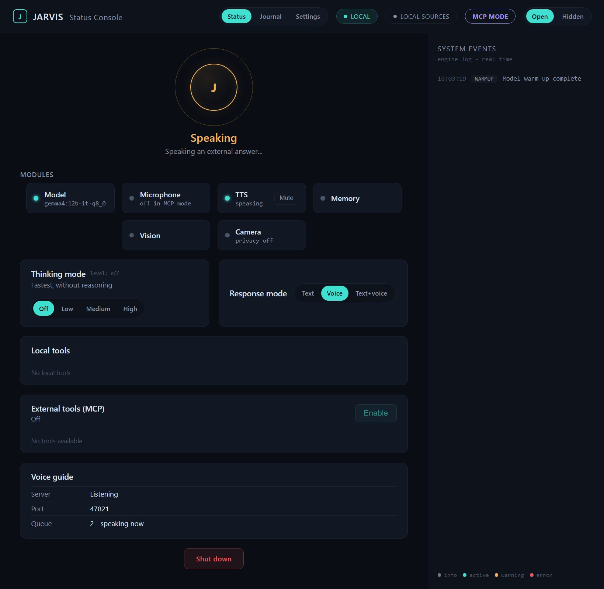
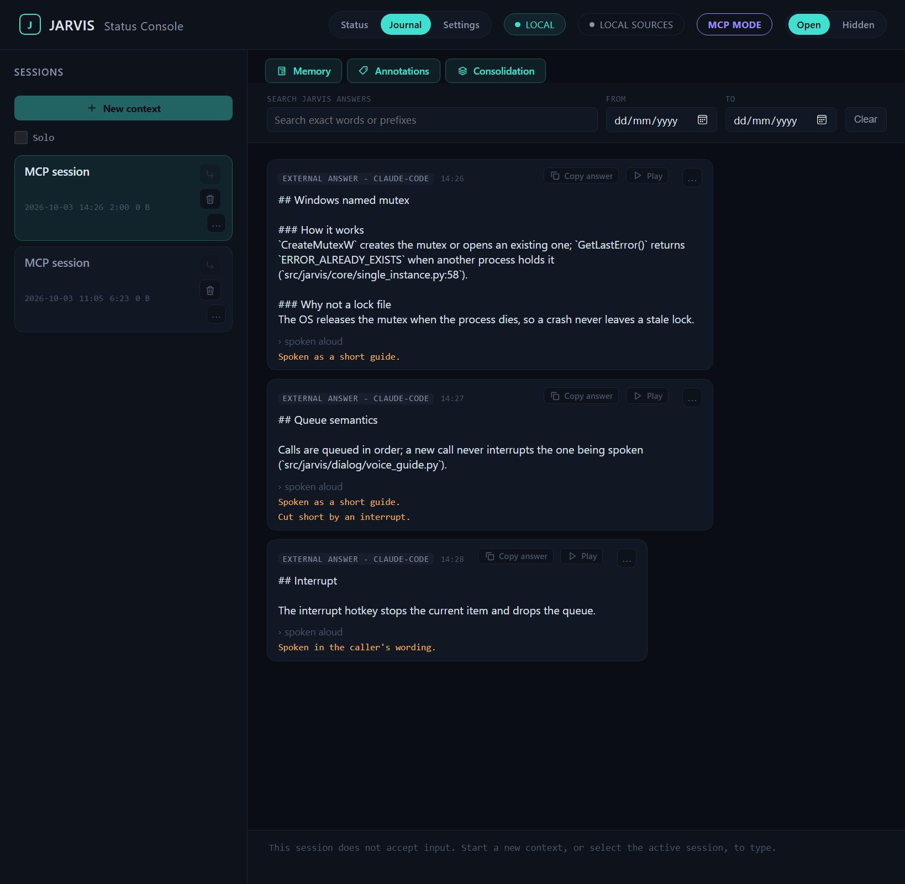

# Jarvis v2.0.0 - MCP voice guide

Jarvis can now be the local voice for another assistant. Start it with
`--mcp-mode`, connect Claude Code (or any MCP client) once, and long answers
that are hard to read become a short spoken guide: Jarvis names the sections,
files, and lines worth looking at, while you read the full answer in the
client's window. With the default local Ollama, everything stays on the
machine.



## What's new

### Voice guide mode (`--mcp-mode`)

- **One local MCP tool, `speak(canvas, spoken_text?, guidance?)`**, served
  over streamable HTTP on `127.0.0.1` only, behind a bearer token. The token
  is generated on the first start into `mcp_mode.token` and reused, so the
  client registration survives restarts; delete the file to rotate it.
- **Three ways to speak a call:**
  - `derivative` (default): the local model writes a short guide over the
    canvas, steered by the optional `guidance`;
  - `verbatim`: the canvas itself is read aloud
    (`[mcp_mode] canvas_speech = "verbatim"`);
  - `spoken_text`: the caller supplies exactly what to say.
- **Non-blocking and queued.** A call returns "queued" with its position at
  once. Calls are spoken in order, one at a time; a new call never cuts off
  the current one. The interrupt hotkey (`Ctrl+Alt+I` by default) stops the
  current item and drops the rest of the queue.
- **Typed limits, never silent truncation:** over-long canvas, guidance, or
  spoken text, and a full queue, are refused with a typed tool error
  (`[mcp_mode]` `max_canvas_chars`, `max_guidance_chars`,
  `max_spoken_text_chars`, `queue_capacity`).
- **No user input reaches the model in this mode:** no microphone, no typed
  chat, no clipboard or screenshot hotkeys. Only interrupt and shutdown are
  bound. The local model gets no tools during the guide pass, so text inside
  a canvas can at most change what is spoken.

### Journal: external answers stay yours, labeled as someone else's



- Every accepted call is journaled once, when it finishes, in the same Journal as
  normal turns: one session per `--mcp-mode` run, titled "MCP session".
- Rows read "External answer - <caller>" and say how the call was spoken
  and, when it was not, why (muted, interrupted, dropped, failed).
- Journal search, heard-phrase search, annotations, and replay work on
  external answers.
- **Provenance is enforced, not just displayed.** An external answer and any
  annotation of it never enter automatic history retrieval. When Jarvis's
  own model searches its history on request, the result is presented as
  another assistant's answer with the caller named. A fork never turns it
  into the local model's own past reply.

### Status Console

- An `MCP MODE` header badge, and a Voice guide block on the Status tab:
  server state, port, and queue length. The token never appears in the UI.
  Hidden mode hides the queue.
- The orb follows the guide: Thinking while the guide is prepared, Speaking
  while it plays, "MCP waiting" at rest.

## Changes that also affect normal mode

- **One Jarvis at a time.** A second start, in either mode, is refused with a
  message box (with the console) and exit code 3. The guard is a Windows
  named mutex, so a crashed Jarvis never leaves a stale lock.
- The Status Console window opens wider by default (1040 logical px instead
  of 960), and header badges no longer wrap.

## Upgrading

1. Update the Python environment the launcher uses. From the Jarvis folder:
   `.venv\Scripts\python.exe -m pip install -r requirements.txt`.
   v2.0.0 needs `mcp>=1.30,<2`, and now declares `uvicorn`, `starlette`, and
   `pydantic` directly.
2. Optional: copy the `[mcp_mode]` section from `config.example.toml` into
   `config.toml`. Without it the defaults apply (port `47821`, token file
   `mcp_mode.token`, `derivative` speech).

## Getting started with Claude Code

```
Jarvis.cmd --mcp-mode
```

(In PowerShell: `.\Jarvis.cmd --mcp-mode`.) Then register the server once,
with the token from `mcp_mode.token`:

```
claude mcp add -s user --transport http jarvis http://127.0.0.1:47821/mcp --header "Authorization: Bearer <token>"
```

Start a new Claude Code session and ask it to pass an answer to Jarvis
through the `speak` tool. Full setup: README, section "Voice guide mode".

## Runtime locality

Core orchestration still needs no network beyond the configured Ollama
endpoint (local by default). `--mcp-mode` adds one inbound path: a
localhost-only, token-protected MCP endpoint. Text that arrives through it is
stored locally, labeled as external in the Journal and in the model's history
search, and kept out of automatic retrieval.

## Known limitations

- The guide is generated in full before the first word is spoken: on a long
  canvas the wait can be about 30 seconds in `derivative` mode. The orb shows
  "Preparing an external answer..." meanwhile. Sentence-by-sentence
  streaming is a planned follow-up.
- Normal mode and `--mcp-mode` cannot run at the same time; switching needs a
  restart.
- After Jarvis restarts, a running Claude Code session may need `/mcp` ->
  `jarvis` -> Reconnect before the next `speak` call goes through.
- Journal search labels every hit on your own turns "Jarvis", and an
  external answer that was dropped, muted, or failed still shows its planned
  speech origin next to its status note. Both are cosmetic and tracked.
- A Journal annotation of an external answer may credit its claims to "the
  assistant": the summarizer is not yet told the text came from another
  assistant. Tracked.
- Claude Code `Stop` hook integration (speaking every answer automatically)
  is not part of v2.0.
